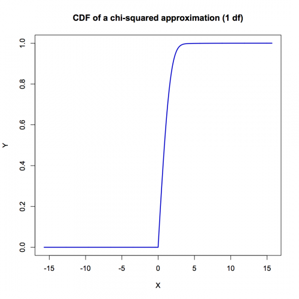

[](http://quantlet.de/index.php?p=info)

## [](http://quantlet.de/) **VaRcdfDG** [](http://quantlet.de/d3/ia)

```yaml

Name of QuantLet : VaRcdfDG

Published in : Applied Quantitative Finance

Description : 'Approximates the cumulative distribution function (CDF) for the class of quadratic
forms of Gaussian vectors.'

Keywords : FFT, cdf, Fourier transform, approximation, frequency

See also : VaRcgfDG, VaRcharfDG, VaRcharfDGF2, VaRcorrfDGF2, VaRqDG, XFGqDGtest, gFourierInversion

Author : Awdesch Melzer

Submitted : Tue, June 04 2013 by Awdesch Melzer

Usage : r = VaRcdfDG(l,N,K,dt)

Input: 
- l: a list containing (at least) the components theta, delta, lambda
- theta: the constant
- delta: the linear term
- lambda: the diagonal of the quadratic terms
- N: scalar, modulus of the FFT, should have a power of 2
- K: scalar, number of characteristic function evaluations; K<=N
- dt: scalar, grid-length in t to use for the approximation

Output: 
- r: a list containing the two components x and y
- x: the grid (vector) in x
- y: the values of the CDF on the grid x

Example : 'Please mind the necessary subroutines. VaRcdfDGtest = function(par,N,dt){ l =
VaRcdfDG(par,N,N,dt) z = cbind(l$x,l$y) plot(z,type="l",col="blue3",lwd=2,xlab="X",ylab="Y")
title("CDF of a chi-squared approximation (1 df)") } theta = 0 delta = c(0) lambda = c(1.4142) par
= list(theta=theta,delta=delta,lambda=lambda) VaRcdfDGtest(par,1024,0.2)'

Result : 'Plots the CDF of a distribution, which is close to the chi^2 distribution with one degree
of freedom.'

```




### R Code:
```r
compl = function(re, im) {
    # Complex array generation
    if (missing(re)) {
        stop("compl: no composed object for real part")
    }
    if (missing(im)) {
        im = 0 * (re <= Inf)
    }
    if (nrow(matrix(re)) != nrow(matrix(im))) {
        stop("compl: dim(re)<>dim(im)")
    }
    z = list()
    z$re = re
    z$im = im
    return(z)
}
cmul = function(x, y) {
    # Complex multiplication
    re = x$re * y$re - x$im * y$im
    im = x$re * y$im + x$im * y$re
    z = list()
    z$re = re
    z$im = im
    return(z)
}
cexp = function(x) {
    # Complex exponential
    re = exp(x$re) * cos(x$im)
    im = exp(x$re) * sin(x$im)
    z = list()
    z$re = re
    z$im = im
    return(z)
}
csub = function(x, y) {
    # Complex subtraction two arrays of complex numbers
    re = x$re - y$re
    im = x$im - y$im
    z = list()
    z$re = re
    z$im = im
    return(z)
}
cdiv = function(x, y) {
    # Complex division
    w = y$re^2 + y$im^2
    re = (x$re * y$re + x$im * y$im)/w
    im = (x$im * y$re - x$re * y$im)/w
    z = list()
    z$re = re
    z$im = im
    return(z)
}
cln = function(x) {
    # Complex natural logarithm
    re = log(x$re^2 + x$im^2)/2
    im = atan2(x$im, x$re)
    z = list()
    z$re = re
    z$im = im
    return(z)
}
creal = function(z) {
    # Returning real part
    re = z$re
    return(re)
}
StandardNormalCharf = function(t, l) {
    # Standard Normal Characteristic Function
    s2 = l$sigma^2
    tmp = compl(-0.5 * s2 * t$re, -0.5 * s2 * t$im + l$mu)
    r = cexp(cmul(tmp, t))
    return(r)
}

gFourierInversion = function(N, K, dt, t0, x0, charf, l) {
    # generic function for density approximation
    
    # 1. form the grids:
    dx = (2 * pi)/(N * dt)
    t = (0:(K - 1)) * dt
    if (t0 != 0) {
        t = t + dt/2
    }
    t = compl(t, t * 0)
    x = x0 + (0:(N - 1)) * dx
    # 2. do the FFT:
    tmp = charf(t, l)
    phi = matrix(1, N, 2)
    phi[1:K, 1] = tmp$re
    phi[1:K, 2] = tmp$im
    tmp = x0 * dt * (0:(N - 1))
    phi = cmul(compl(phi[, 1], phi[, 2]), cexp(compl(tmp * 0, -tmp)))
    phi = cbind(phi$re, phi$im)
    phitmp = complex(real = phi[, 1], imaginary = phi[, 2])
    ninvfft = length(phitmp)
    y = fft(phitmp, inverse = T)  #ninvfft
    y = compl(Re(y), Im(y))
    if (t0 != 0) {
        tmp = x * dt/2
        y = cmul(y, cexp(compl(tmp * 0, -tmp)))
    }
    # 3. rescale:
    if (t0 == 0) {
        r = dt * (creal(y) - 0.5 * creal(charf(list(re = 0, im = 0), l)))/pi
    } else {
        r = dt * creal(y)/pi
    }
    return(r)
}

VaRcgfDG = function(t, par) {
    # cumulant generating function (cgf) for the class of quadratic forms of Gaussian vectors.
    
    s = compl(par$theta * t$re, par$theta * t$im)
    i = 1
    m = length(par$lambda)
    while (i <= m) {
        # 1-lambda*t:
        omlt = compl(1 - par$lambda[i] * t$re, -par$lambda[i] * t$im)
        tmp = cmul(t, t)
        tmp = cdiv(tmp, omlt)
        tmp = compl(par$delta[i]^2 * tmp$re, par$delta[i]^2 * tmp$im)
        tmp = csub(tmp, cln(omlt))
        s = compl(s$re + 0.5 * tmp$re, s$im + 0.5 * tmp$im)
        i = i + 1
    }
    return(s)
}


VaRcharfDG = function(t, par) {
    # computes the characteristic function for the class of quadratic forms of Gaussian vectors.
    t = compl(-t$im, t$re)  # 1i*t
    r = cexp(VaRcgfDG(t, par))
}

VaRcharfDGF2 = function(t, l) {
    # Fourier transform of an approximating Gaussian cdf
    mu = l$theta + 0.5 * sum(l$lambda)
    s2 = sum(l$delta^2 + 0.5 * l$lambda^2)
    tmp = compl(-0.5 * s2 * t$re, -0.5 * s2 * t$im + mu)
    tmp = cexp(cmul(tmp, t))
    tmp = csub(VaRcharfDG(t, l), tmp)
    tmp = cdiv(tmp, t)
    r = compl(-tmp$im, tmp$re)
    r$re = replace(r$re, r$re == "NaN", 0)
    r$im = replace(r$im, r$im == "NaN", 0)
    return(r)
}

VaRcorrfDGF2 = function(x, l) {
    # cdf of normal approximation
    mu = l$theta + 0.5 * sum(l$lambda)
    s2 = sum(l$delta^2 + 0.5 * l$lambda^2)
    r = pnorm((x - mu)/sqrt(s2))
    return(r)
}


#################### MAIN FUNCTION ####################

VaRcdfDG = function(l, N, K, dt) {
    
    dx = 2 * pi/(N * dt)
    x0 = -pi/dt
    y = gFourierInversion(N, K, dt, dt/2, x0, VaRcharfDGF2, l)
    x = x0 + (0:(N - 1)) * dx
    y = y + VaRcorrfDGF2(x, l)
    y[x <= 0] = 0  # correct for misspecification
    r = list(x = x, y = y)
    return(r)
}

#################### TEST FUNCTION ####################

VaRcdfDGtest = function(par, N, dt) {
    l = VaRcdfDG(par, N, N, dt)
    z = cbind(l$x, l$y)
    plot(z, type = "l", col = "blue3", lwd = 2, xlab = "X", ylab = "Y")
    title("CDF of a chi-squared approximation (1 df)")
}

theta = 0
delta = c(0)
lambda = c(1.4142)
par = list(theta = theta, delta = delta, lambda = lambda)
VaRcdfDGtest(par, 1024, 0.2)
 

```
