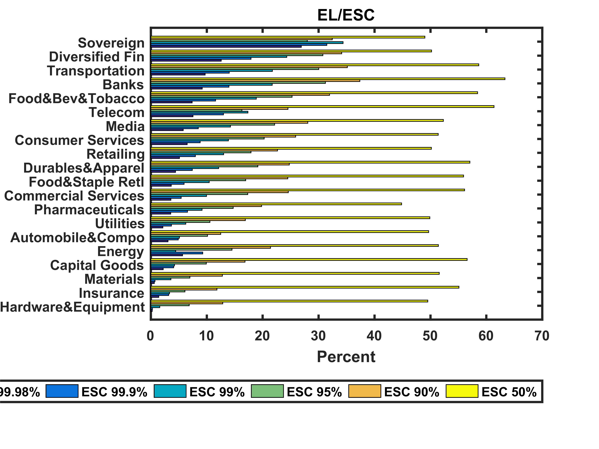

[](http://quantlet.de/index.php?p=info)

## [](http://quantlet.de/) **XFGELESC** [](http://quantlet.de/d3/ia)

```yaml

Name of Quantlet : XFGELESC

Published in : Applied Quantitative Finance

Description : 'Shows Expected Loss/Risk Ratio for the Expected Shortfall Contribution at different
quantiles.'

Keywords : 'Expected loss, asset, bar chart, data visualization, expected shortfall, graphical
representation, portfolio, quantile, returns, risk, risk capital exposure, risk contribution'

See also : 'XFGIndustryBreakdown, XFGRegionsBreakdown, XFGRsquared, XFGriskaversion,
XFGriskaversion2'

Author : Ludger Overbeck, Maria Sokolova

Submitted : 2015-03-04 by Lukas Borke

Example : XFGELESC.png

```




### MATLAB Code:
```matlab
%% CODE

data=[
0.25    0.29    1.61    6.85    12.85   49.53
1.43    3.18    3.33    6.09    11.83   55.10
0.62    0.73    3.59    6.97    12.79   51.58
2.22    4.09    4.24    9.92    16.85   56.57
5.67    9.27    4.43    14.50   21.41   51.42
3.07    4.89    5.13    10.15   12.48   49.68
2.15    3.67    6.25    10.58   16.90   49.88
3.57    6.56    9.17    14.74   19.82   44.84
3.59    5.43    9.96    17.33   24.57   56.11
3.64    5.93    10.44   16.95   24.49   55.92
4.41    7.40    12.13   19.12   24.76   57.05
5.13    7.95    13.00   17.90   22.65   50.16
6.49    8.81    13.88   20.28   25.90   51.38
5.80    8.48    14.23   22.12   28.08   52.31
7.55    12.98   17.35   16.29   24.53   61.37
7.38    11.58   18.87   25.24   31.96   58.42
9.20    13.97   21.70   31.23   37.38   63.31
9.72    14.02   21.72   30.03   35.13   58.65
12.58   17.92   24.29   30.75   34.12   50.18
26.91   31.48   34.38   27.97   32.43   49.00
];

%% PLOT

barh(data,1)
set(gca,'YTick',1:20);
set(gca,'YTickLabel', {'Hardware&Equipment' 'Insurance'  'Materials' 'Capital Goods' 'Energy' 'Automobile&Compo' 'Utilities' 'Pharmaceuticals' 'Commercial Services' 'Food&Staple Retl' 'Durables&Apparel' 'Retailing' 'Consumer Services' 'Media' 'Telecom' 'Food&Bev&Tobacco' 'Banks' 'Transportation' 'Diversified Fin' 'Sovereign'})
set(gca,'FontSize',10,'FontWeight','Bold')
title('EL/ESC','FontSize',16,'FontWeight','Bold')
xlabel('Percent')
legend('ESC 99.98%', 'ESC 99.9%', 'ESC 99%', 'ESC 95%', 'ESC 90%', 'ESC 50%', 'Location', 'BestOutside','Orientation','horizontal')
ylim([0 21])
box on
set(gca,'LineWidth',1.6,'FontSize',10,'FontWeight','Bold')

% to save plot please uncomment following lines
print -painters -dpng -r600 XFGELESC.png
% print -painters -dpdf -r600 XFGELESC.pdf
```
