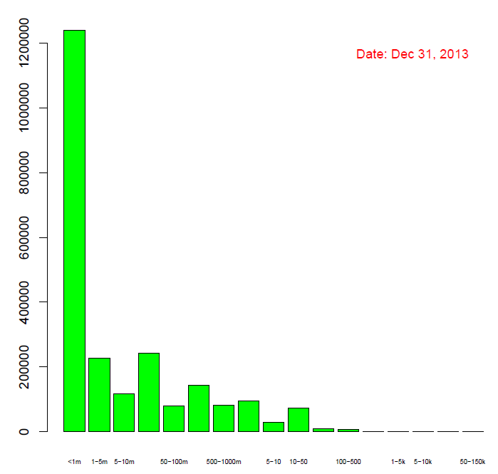
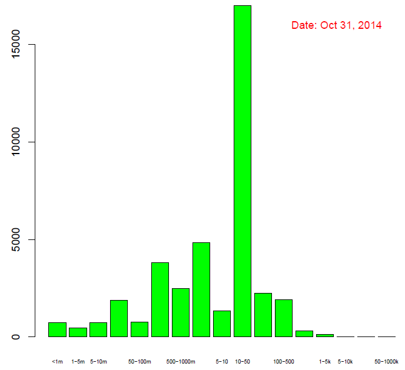

[](http://quantlet.de/index.php?p=info)

## [](http://quantlet.de/) **XFGHistWealthD** [](http://quantlet.de/d3/ia)


```yaml
<Name of QuantLet : XFGHistWealthD

Published in : Applied Quantitative Finance

Description : 'Generates 3 histgrams of wealth distribution for Bitcion and Auroracoin.'

Keywords : 'power law, bitcoin, crypto, currency, index, wealth distribution'

See also : 

Author : Guo Li

Submitted :

Datafile : i.csv, i = 1, 2, ..., 60; Bitcoin_Data1.csv; Aj.csv, j=2, 3, ..., 10 Auroracoin.csv

Example : wealth distribution for Bitcoin and wealth distribution for Auroracoin.>
```






```R
<# please download the following package
libraries               = c("lubridate", "poweRlaw","igraph","tables","texreg")
lapply(libraries, library, quietly = TRUE, character.only = TRUE)
# Draw Figure 2
setwd("~/Desktop/Data")
Data.PL                 = read.csv(paste(64, ".csv", sep = ""), header = T)[, 1]
m                       = hist(Data.PL, 
                               breaks = c(0, 0.001, 0.005, 0.01, 0.05, 0.1, 0.5, 1, 
                                          5, 10, 50, 100, 500, 1000, 5000, 10000, 
                                          50000, 150000), 
                               freq   = F)
BP                      = barplot(m$count, 
                                  names.arg = c("<1m", "1-5m", "5-10m", "10-50m", 
                                                "50-100m", "100-500m", "500-1000m", 
                                                "1-5", "5-10", "10-50", "50-100", 
                                                "100-500", "500-1k", "1-5k", "5-10k", 
                                                "10-50k", "50-150k"), 
                                  cex.names = 0.5, 
                                  col       = "green", 
                                  main      = list("Bitcoin Public Address Distribution Count by Balance", font = 4))                                              
mtext(side              = 3, 
      at                = 17, 
      line              = -2, 
      text              = paste("Date: Dec 31, 2013"), 
      col               = "red")


# Draw Figure 3
Auroracoin.PL           = read.csv(paste("A10.csv", sep = ""), header = T)[, 1]
m                       = hist(Auroracoin.PL, 
                               breaks       = c(0, 0.001, 0.005, 0.01, 0.05, 0.1, 0.5, 
                                                1, 5, 10, 50, 100, 500, 1000, 5000, 
                                                10000, 50000, 1e+06), 
                               freq         = F)
BP                      = barplot(m$count, 
                                  names.arg = c("<1m", "1-5m", "5-10m", "10-50m", "50-100m", 
                                                "100-500m", "500-1000m", "1-5", "5-10", 
                                                "10-50", "50-100", "100-500", "500-1k", 
                                                "1-5k", "5-10k", "10-50k", "50-1000k"), 
                                  cex.names = 0.5, 
                                  col       = "green", 
                                  main      = list("Auroracoin Public Address Distribution Count by Balance", font = 4))
mtext(side              = 3, 
      at                = 17, 
      line              = -2, 
      text              = paste("Date: Oct 31, 2014"), 
      col               = "red")

# Draw Figure 4
Auroracoin.PL           = read.csv(paste("A10.csv", sep = ""), header = T)[, 1]
Auroracoin.PL           = Auroracoin.PL[(Auroracoin.PL >= 10)]
m                       = hist(Auroracoin.PL, 
                               breaks       = c(10, 50, 100, 500, 1000, 5000, 10000, 
                                                50000, 1e+06), freq = F)
BP                      = barplot(m$count, 
                                  names.arg = c("10-50", "50-100", "100-500", 
                                                "500-1k", "1-5k", "5-10k", "10-50k", "50-1000k"), 
                                  cex.names = 0.5, 
                                  col       = "green", 
                                  main      = list("Auroracoin Public Address Distribution Count by Balance", font = 4))
mtext(side              = 3, 
      at                = 17, 
      line              = -2, 
      text              = paste("Date: Oct 31, 2014"), col = "red")


>
```
