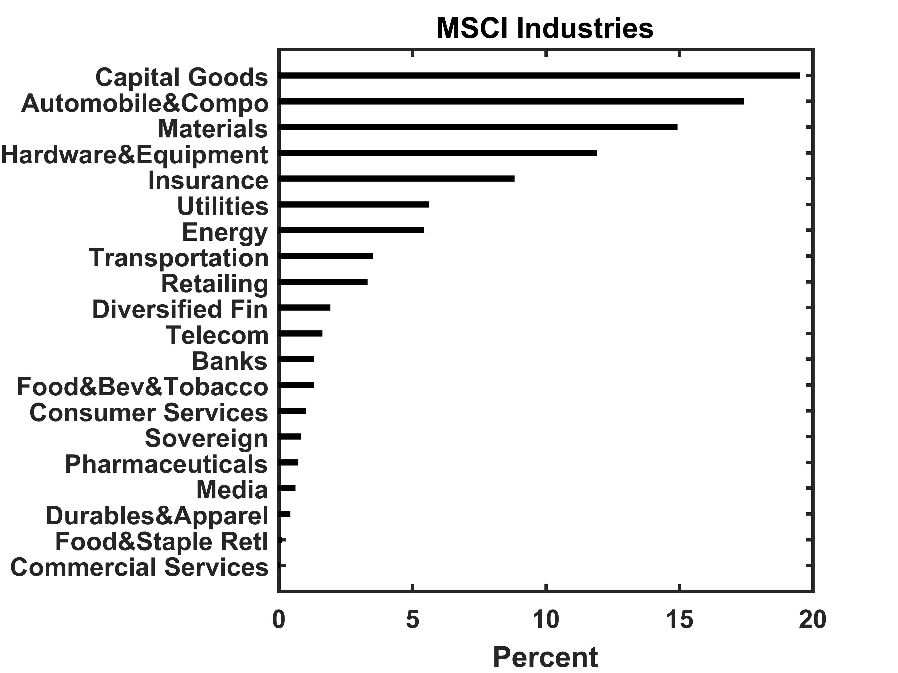

[](http://quantlet.de/index.php?p=info)

## [](http://quantlet.de/) **XFGIndustryBreakdown** [](http://quantlet.de/d3/ia)

```yaml

Name of Quantlet : XFGIndustryBreakdown

Published in : Applied Quantitative Finance

Description : 'Shows the MSCI industry breakdown of the portfolio consisting of 279 assets with
total notional EUR 13.7bn. The industry breakdown is presented in a bar chart.'

Keywords : 'asset, bar chart, data visualization, graphical representation, industry breakdown,
portfolio'

See also : XFGELESC, XFGRegionsBreakdown, XFGRsquared, XFGriskaversion, XFGriskaversion2

Author : Ludger Overbeck, Maria Sokolova

Submitted : 2015-02-18 by Lukas Borke

Example : XFGIndustryBreakdown.png

```




### MATLAB Code:
```matlab
% clear variables and close graphics
clear all
close all
clc

barh([0.0, 0.1, 0.4, 0.6, 0.7, 0.8, 1.0, 1.3, 1.3, 1.6, 1.9, 3.3, 3.5, 5.4, 5.6, 8.8, 11.9, 14.9, 17.4, 19.5],0.2,'k')
set(gca,'YTick',1:20);
set(gca,'YTickLabel',{'Commercial Services' 'Food&Staple Retl' 'Durables&Apparel' 'Media' 'Pharmaceuticals' 'Sovereign' 'Consumer Services' 'Food&Bev&Tobacco' 'Banks' 'Telecom' 'Diversified Fin' 'Retailing' 'Transportation' 'Energy' 'Utilities' 'Insurance' 'Hardware&Equipment' 'Materials' 'Automobile&Compo' 'Capital Goods' })
set(gca,'FontSize',12,'FontWeight','Bold')
title('MSCI Industries','FontSize',16,'FontWeight','Bold')
xlabel('Percent','FontSize',12,'FontWeight','Bold')
box on
set(gca,'LineWidth',1.6,'FontSize',12,'FontWeight','Bold')
ylim([0 21])

% to save plot please uncomment following lines 
% print -painters -dpng -r600 XFGIndustryBreakdown.png
% print -painters -dpdf -r600 XFGIndustryBreakdown.pdf

```
