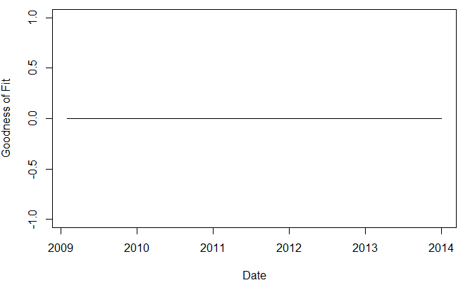

[](http://quantlet.de/)

## [](http://quantlet.de/) **XFGPowerLawP** [](http://quantlet.de/)

```yaml

Name of QuantLet : XFGPowerLawP

Published in : Applied Quantitative Finance

Description : 'Plots the time series of the goodness of fit of Power Law model for both Bitcoin and
Auroracoin.'

Keywords : power law, bitcoin, crypto, currency, index, wealth distribution

Author : Guo Li

Datafile : i.csv, i = 1, 2, ..., 60; Bitcoin_Data1.csv; Aj.csv, j=2, 3, ..., 10

Example : Time series plots of parameter goodness of fit for wealth distribution of Bitcoin.

```




### R Code:
```r
setwd("~/Desktop/Data")
source("XFGPowerLawEst1.R")
# sample period
startDate                                  = ymd(20081231)
Date                                       = startDate %m+% months(c(1:(length(alpha))))
# Draw Figure 7: Bitcoin goodness of fit (whole sample)
plot(Date[1:length(Date)], P, 
     type                                     = "l", 
     ylab                                     = c("Goodness of Fit"), 
     xlab                                     = c("Date"), 
     main                                     = "Goodness of Fit of Bitcoin using Whole Sample")


#Goodness of Fit of right tail wealth distribution of Auroracoin
source("XFGPowerLawEst2.R")
# sample period
startDate                                  = ymd(20140228)
Date                                       = startDate %m+% months(c(1:(length(alpha.2))))
# Draw Figure 8: Auroracoin goodness of fit (right tail)
plot(Date[1:length(Date)], P.2, 
     type                                     = "l", 
     ylab                                     = c("Goodness of Fit"), 
     xlab                                     = c("Date"), 
     main                                     = "Goodness of Fit of Bitcoin using Whole Sample")


#Goodness of Fit of right tail wealth distribution of Bitcoin
source("XFGPowerLawEst3.R")
# sample period
startDate                                  = ymd(20081231)
Date                                       = startDate %m+% months(c(1:(length(alpha))))
# Draw Figure 10: Bitcoin goodness of fit (Right Tail)
plot(Date[1:60], P, 
     type                                     = "l", 
     ylab                                     = c("Goodness of Fit"), 
     xlab                                     = c("Date"), 
     main                                     = "Goodness of Fit of Bitcoin (Right Tail)")


```
