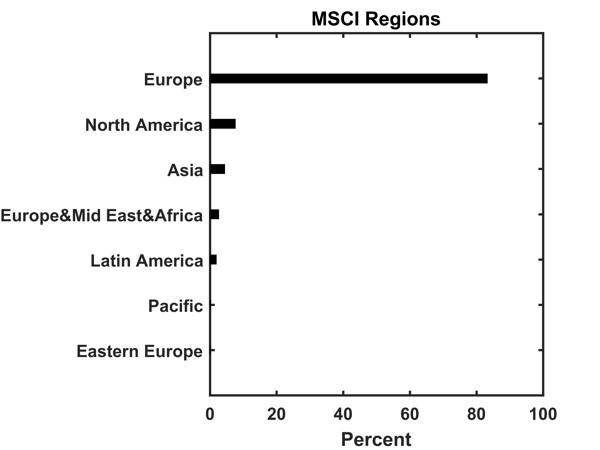

[](http://quantlet.de/index.php?p=info)

## [](http://quantlet.de/) **XFGRegionsBreakdown** [](http://quantlet.de/d3/ia)

```yaml

Name of QuantLet : XFGRegionsBreakdown

Published in : Applied Quantitative Finance

Description : 'Shows the MSCI regions breakdown of the portfolio consisting of 279 assets with
total notional EUR 13.7bn. The regions breakdown is presented in a bar chart.'

Keywords : 'asset, bar chart, data visualization, graphical representation, portfolio, regions
breakdown'

See also : XFGELESC, XFGIndustryBreakdown, XFGRsquared, XFGriskaversion, XFGriskaversion2

Author : Ludger Overbeck, Maria Sokolova

Submitted : 2015-02-17 by Lukas Borke

Example : XFGRegionsBreakdown.png

```




### MATLAB Code:
```matlab
% clear variables and close graphics
clear all
close all
clc

barh([0.1, 0.2, 1.9, 2.6, 4.4, 7.6, 83.2 ],0.2,'k')
set(gca,'YTick',1:7);
set(gca,'YTickLabel',{'Eastern Europe' 'Pacific' 'Latin America' 'Europe&Mid East&Africa' 'Asia' 'North America' 'Europe' })
set(gca,'FontSize',12,'FontWeight','Bold')
title('MSCI Regions','FontSize',16,'FontWeight','Bold')
xlabel('Percent','FontSize',12,'FontWeight','Bold')
box on
set(gca,'LineWidth',1.6,'FontSize',12,'FontWeight','Bold')
ylim([0 8])

% to save plot please uncomment following lines
% print -painters -dpng -r600 XFGRegionsBreakdown.png
% print -painters -dpdf -r600 XFGRegionsBreakdown.pdf

```
