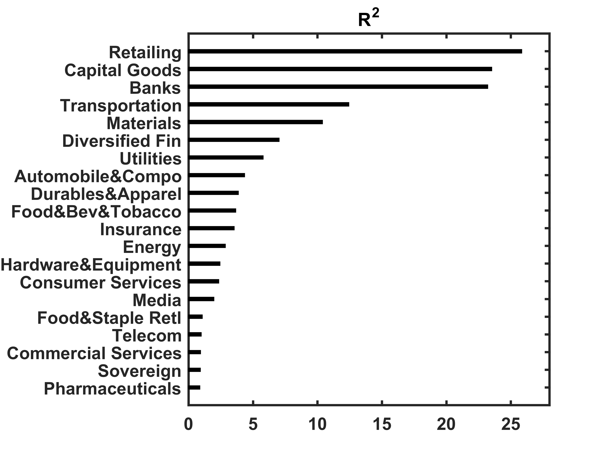

[](http://quantlet.de/index.php?p=info)

## [](http://quantlet.de/) **XFGRsquared** [](http://quantlet.de/d3/ia)

```yaml

Name of Quantlet : XFGRsquared

Published in : Applied Quantitative Finance

Description : 'Shows the R^2 of a one-dimensional regression of the 279 MSCI asset returns with
respect to its composite factor, modeled as the sum of the industry and country factor. The
underlying factor model is based on 24 MSCI industries and 7 MSCI regions. The weighted average R^2
is 0.5327. The R^2 is required to obtain the portfolio correlation structure.'

Keywords : 'R-squared, asset, bar chart, correlation, data visualization, factor-model, graphical
representation, portfolio, regression, returns'

See also : XFGELESC, XFGIndustryBreakdown, XFGRegionsBreakdown, XFGriskaversion, XFGriskaversion2

Author : Ludger Overbeck, Maria Sokolova

Submitted : Thu, February 19 2015 by Lukas Borke

Example : XFGRsquared.png

```




### MATLAB Code:
```matlab
% clear variables and close graphics
clear all
close all
clc

x = [0.88, 0.91, 0.93, 0.98, 1.06, 1.96, 2.34, 2.43, 2.85,  3.54,  3.66, 3.86, 4.35, 5.78, 7.02, 10.39, 12.43, 23.21, 23.52, 25.85];
barh(x,0.2,'k')
set(gca,'YTick',1:20);
set(gca,'YTickLabel',{'Pharmaceuticals' 'Sovereign' 'Commercial Services' 'Telecom' 'Food&Staple Retl' 'Media' 'Consumer Services' 'Hardware&Equipment' 'Energy' 'Insurance' 'Food&Bev&Tobacco' 'Durables&Apparel' 'Automobile&Compo' 'Utilities' 'Diversified Fin' 'Materials'  'Transportation'  'Banks'  'Capital Goods'  'Retailing'})
set(gca,'FontSize',12,'FontWeight','Bold')
title('R^2','FontSize',16,'FontWeight','Bold')
box on
set(gca,'LineWidth',1.6,'FontSize',12,'FontWeight','Bold')
xlim([0 28])
ylim([0 21])

% to save plot please uncomment following lines 
% print -painters -dpng -r600 XFGRsquared.png
% print -painters -dpdf -r600 XFGRsquared.pdf

```
