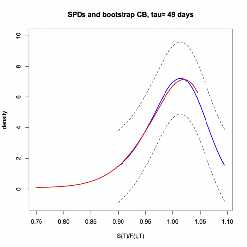

[](http://quantlet.de/index.php?p=info)

## [](http://quantlet.de/) **XFGSPDcb2** [](http://quantlet.de/d3/ia)

```yaml

Name of QuantLet : XFGSPDcb2

Published in : Applied Quantitative Finance

Description : 'Outputs SPD estimates for DAX option data on Jan 3, 1997 on Jan 31, 1997 and the
bootstrap confidence intervals for the first date. Both SPDs correspond to the same maturity (49
days) and are displayed on a moneyness metric. Computes the State-Price Density for European
options using the result of Breeden and Litzenberger and compares with estimates of Rookley''s
method. For more insight, please follow the description of the subroutines.'

Keywords : 'SPD, bandwidth, black-scholes, confidence-bands, confidence-interval, derivative,
implied-volatility, kernel smoothing, locap polynomial smoothing, option-price, semiparametric,
standardize, state-price-density'

See also : 'TXTSimulation, TXTSimulationAttention, TXTSimulationBS, XFGIBT01, XFGIBT02, XFGIBT03,
XFGSPDcom, XFGSPDoneday, XFGSPDonemonth'

Author : Awdesch Melzer

Submitted : Wed, July 09 2014 by Awdesch Melzer

Datafiles : XFGData9701.dat

```




### R Code:
```r
rm(list=ls(all=TRUE))
graphics.off()

# install.packages("matlab")
# install.packages("locpol")
# install.packages("KernSmooth")
library(matlab)
library(locpol)
library(KernSmooth)

# set working directory for data loading
# setwd("/Users/...")


#######################################################################
########################### SUBROUTINES ###############################
#######################################################################

SPDlp2 = function(RawData, xGrid, locband, metric){
 
  p            = 2 # polynomial order
  Scorrected   = as.matrix(RawData[,1]*exp(-RawData[,3]*RawData[,4]))
  Moneyness    = Scorrected/RawData[,2]
  Maturity     = RawData[,4]
  ivola        = RawData[,7]
 
################################################################################################
# The following case corresponds to: 
# RawData entails data of one smile!
  if (metric==0){
    xGridTemp   = as.matrix(Scorrected[1]/xGrid)
  }else{
    if (metric==1){
      xGridTemp = as.matrix(Scorrected[1]/(xGrid*RawData[1,1]))
    }
  }
  hGrid         = c(seq(0.02,by=0.05,length=10),seq(0.5,by=0.2,length=15))
          
# In the next lines, we first estimate the smile with an automatic selection of the local bandwidths.
# Then, we reuse the same bandwiths to estimate the first and second derivative of the smile!
# In a last step, we use these estimations to compute the spd using the result of Rookley (see spdbl.xpl)
  MoneynessSTD  = (Moneyness-matrix(mean(Moneyness),nrow(Moneyness),ncol(Moneyness)))/matrix(sqrt(var(Moneyness)),nrow(Moneyness),ncol(Moneyness))
  xGridTempSTD  = (xGridTemp[,1]-mean(Moneyness))/sqrt(var(Moneyness))
  dataf         = data.frame(tmp1=MoneynessSTD,tmp2=ivola) 
  smile         = locpoly(x=MoneynessSTD,y=ivola,gridsize=length(xGridTempSTD),range.x=c(min(xGridTempSTD),max(xGridTempSTD)),bandwidth=locband)$y
         
  FirstDerSmile = locpoly(x=MoneynessSTD,y=ivola,gridsize=length(xGridTempSTD),range.x=c(min(xGridTempSTD),max(xGridTempSTD)),bandwidth=locband,drv=1)$y/c(sqrt(var(Moneyness)))
          
  SecondDerSmile= locpoly(x=MoneynessSTD,y=ivola,gridsize=length(xGridTempSTD),range.x=c(min(xGridTempSTD),max(xGridTempSTD)),bandwidth=locband,drv=2)$y/c(var(Moneyness))
          
  result        = spdbl(flipud(xGridTemp),smile,FirstDerSmile,SecondDerSmile,Scorrected[1,1],RawData[1,3],RawData[1,4])
  if (metric==0){
    fstar=result$fstar
  }else{
    fstar=RawData[1,1]*result$fstar
  }
  band=locband
return(list(fstar=fstar,band=band))
}


spdbl = function(m, sigma, sigma1, sigma2, s, r, tau){ # (fstar,delta, gamma)
#       spdbl uses the Breeden and Litzenberger (1978) method and a
#		semiparametric specification of the Black-Scholes
#		option pricing function to calculate the empirical State 
#		Price Density. The analytic formula uses an estimate of 
#	 	the volatility smile and its first and second derivative to
#		calculate the State-price density, as well as Delta and 
#		Gamma of the option. This method can only be applied to
#		European options (due to the assumptions).   


  rm   = length(m)
  ones = matrix(1,rm,1)
  st   = sqrt(tau)
  ert  = exp(r*tau)
  rt   = r*tau
  
#Modified Black-Scholes scaled by S-div instead of F
  d1   = (log(m)+tau*(r+0.5*(sigma^2)))/(sigma*st)
  
  d2   = d1-sigma*st
 

  f    = pnorm(d1)-pnorm(d2)/(ert*m)
 

#first derivative of d1 term
  d11  = (1/(m*sigma*st))-(1/(st*(sigma^2)))*((log(m)+tau*r)*sigma1)+0.5*st*sigma1


#first derivative of d2 term
  d21  = d11-st*sigma1


#second derivative of d1 term
  d12  = -(1/(st*(m^2)*sigma))-sigma1/(st*m*(sigma^2))+sigma2*(0.5*st-(log(m)+rt)/(st*(sigma^2)))+sigma1*(2*sigma1*(log(m)+rt)/(st*sigma^3)-1/(st*m*sigma^2))


#second derivative of d2 term
  d22  = d12-st*sigma2


#Please refer to either Rookley (1997) or the XploRe Finance Guide for derivations
  f1   = dnorm(d1)*d11+(1/ert)*((-dnorm(d2)*d21)/m+pnorm(d2)/(m^2))

  f2   = dnorm(d1)*d12-d1*dnorm(d1)*(d11^2)-(1/(ert*m)*dnorm(d2)*d22)+ ((dnorm(d2)*d21)/(ert*m^2))+(1/(ert*m)*d2*dnorm(d2)*(d21^2))-(2*pnorm(d2)/(ert*(m^3)))+(1/(ert*(m^2))*dnorm(d2)*d21) 


#recover strike price
  x    = s/m  
  	
  c1   = -(m^2)*f1

  c2   = s*((1/x^2)*((m^2)*f2+2*m*f1))

#calculate the quantities of interest
  cdf  = ert*c1+1

  fstar= ert*c2

  delta= f + s* f1/x

  gamma= 2*f1/x+s*f2/(x^2)

return(list(fstar=fstar,delta=delta, gamma=gamma))
}


bootstrap = function(x,nb,opt){
  n = length(x)
  if(opt=="wild"){
    sq5 = sqrt(5)
    aa  = (1-sq5)/2  		# define golden section bootstrap
    bb  = aa+sq5
    cc  = (5+sq5)/10  
    mult= matrix(runif(n*nb),n,nb)
    mult= aa*(mult<cc) + bb*(mult>=cc) 
    bx  = (mult * c(x)) 
    
   }
   return(bx)
}


spdci = function(RawData,coef,xGrid,metric,locband){
  
  IR          = RawData[,3]                               # interest rate
  mat         = RawData[,4]                               # time to maturity
  moneyness   = (RawData[,1]*exp(-IR*mat))/RawData[,2]    # moneyness

  IVpoints    = cbind(moneyness,RawData[,4],RawData[,7])  # implied volatility
#IVpoints=sort(IVpoints)

  bn          = 100        # number of elements selected for bootstrap

  IVpointsSTD = cbind((IVpoints[,1]-mean(IVpoints[,1]))/sqrt(var(IVpoints[,1])),(IVpoints[,2]-mean(IVpoints[,2]))/sqrt(var(IVpoints[,2]))) # standardized IV points
  SPD1stEstimation = SPDlp2(RawData,xGrid,locband,metric)  
  IVs          = data.frame(IvpSTD=IVpointsSTD[,1],Ivp=IVpoints[,3])     
  IVsurf       = locpol(Ivp~IvpSTD,data=IVs,bw=locband,xevalLen=length(IVpointsSTD[,1]))
  IVsurfg      = locpol(Ivp~IvpSTD,data=IVs,bw=(coef*locband),xevalLen=length(IVpointsSTD[,1]))

# estimation of SPD for original smoothed vola
  f            = flipud(SPD1stEstimation$fstar)
#######################################################################################
#As the local bandwidths are chosen using standardized data, we
#have to standardize them before applying lplocband with local
#bandwidths equal to coef.*SPD1stEstimation.band

  eps          = (flipud(IVsurf$lpFit[,2])-IVpoints[,3])
  eps          = eps-mean(eps)
  beps         = bootstrap(eps,bn,"wild")
#######################################################################################
  i=1
  while(i< bn+1){
    IVpointstar  = cbind(RawData[,1:6],(flipud(IVsurfg$lpFit[,2]) + beps[,i]))
    SPDEstimates = SPDlp2(IVpointstar,xGrid,locband,metric)
    if (i==1){
      fci=(SPDEstimates$fstar)
    }else{
      fci=cbind(fci,SPDEstimates$fstar)
    }
    i=i+1
  }
return(list(f=f,fci=fci))
}


caltm = function(ospd, bspd, alpha,CBorCI){
  m = ncol(bspd)
  i = 1
  if(CBorCI=="CB"){
    while(i <= m){
      z = max(abs(bspd[,i]-ospd))
      if (i == 1){
        y = z
      }else{
        y = c(y,z)
      }
      i = i+1
    }
    tmlow = quantile(y, alpha/2)
    tmup  = quantile(y, 1-alpha/2)
  }else{
    while(i<=nrow(bspd)){
      tmlowTemp = quantile(c(bspd[i,]), alpha/2)
      tmupTemp  = quantile(c(bspd[i,]), 1-alpha/2)
      if(i==1){
        tmlow = tmlowTemp
        tmup  = tmupTemp
      }else{
        tmlow = c(tmlow,tmlowTemp)
        tmup  = c(tmup,tmupTemp)
      }
      i=i+1
    }
  }
return(list(tmup=tmup, tmlow=tmlow))
}


#######################################################################
########################### Main Calculation ##########################
#######################################################################

  coef=1.3
  
  dataloaded   = read.table("XFGData9701.dat")
  data         = subset(dataloaded, dataloaded[,10]>0)
  data         = subset(data,(data[,1]==3)&(data[,4]==1)&(data[,5]==49)) # &(data[,5]<30)

  mat          = data[,5]/365 # time to maturity
  IR           = data[,9]     # risk free interest rate
  ForwardPrice = data[,8]*exp(IR*mat)
  RawData      = cbind(ForwardPrice,data[,6],IR,mat,data[,7],data[,4],data[,10])


  date         = data[1,1]+ data[1,2]*100+ data[1,3]*10000

  locband      = 0.75		
  xGrid        = seq(0.9,by=0.005,length=40)
  metric       = 1
  temp         = spdci(RawData, coef, xGrid, metric,locband)
  f            = temp$f
  fci          = temp$fci 

  result       = caltm(f, fci, 0.1,"CB")
  clo          = f - result$tmup
  cup          = f + result$tmup
  fh           = cbind(xGrid,f)   
  clo          = cbind(xGrid,clo) 
  cup          = cbind(xGrid,cup) 
 
  
  data         = subset(dataloaded, dataloaded[,10]>0)
  data         = subset(data,(data[,1]==31)&(data[,4]==1)&(data[,5]==49))

  mat          = data[,5]/365
  IR           = data[,9]
  ForwardPrice = data[,8]*exp(IR*mat)
  RawData      = cbind(ForwardPrice,data[,6],IR,mat,data[,7],data[,4],data[,10])

  xGrid        = seq(0.75,by=0.005,length=60)
  metric       = 1
  SPD31January = SPDlp2(RawData, xGrid, locband, metric)
  fbis         = cbind(flipud(xGrid),SPD31January$fstar) # "red"

  meanmf       = max(f) 
  measure      = 10^(floor(log10(meanmf))+1)
  

plot(fh, xlab="S(T)/F(t,T)",ylab="density",type="l",col="blue",lwd=2,ylim=c(-1,10),xlim=c(min(fbis[,1]),max(fh[,1])))
  lines(fbis,lwd=2,col="red")
  lines(clo, lty="dashed")
  lines(cup, lty="dashed")
  title(paste("SPDs and bootstrap CB, tau= 49 days"))


```
