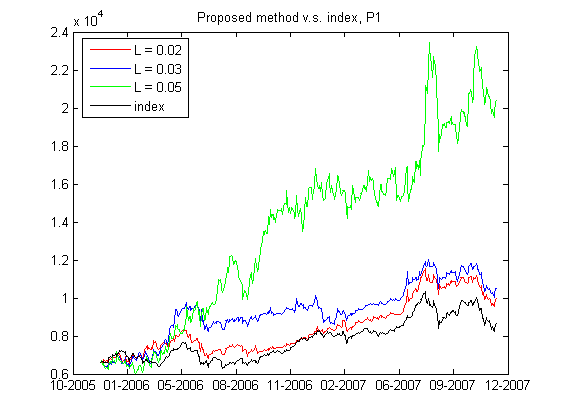

[](http://quantlet.de/)

## [](http://quantlet.de/) **XFGTWSE100_strategy_fixedESlevel** [](http://quantlet.de/)

```yaml

Name of QuantLet : XFGTWSE100_strategy_fixedESlevel

Published in : XFG (3rd Edition)

Description : 'Computes the values of the self-financing trading strategy and the FTSE TWSE Taiwan
100 Index for three different economic conditions with different fixed bounds of risk.'

Keywords : 'copula, dynamic, expected shortfall, garch, linear programming, portfolio, risk
aversion, risk measure'

Author : Shih-Feng Huang

Datafile : 'weight L=002a.xlsx, weight L=003a.xlsx, weight L=005a.xlsx, ER L002a.xlsx, ER
L003a.xlsx, ER L005a.xlsx, index 0712.csv, all 2365 empirical.csv'

Example : 'The values of the self-financing trading strategy and the FTSE, TWSE Taiwan 100 Index
with different fixed upper bounds of risk.'

```




### MATLAB Code:
```matlab
%-------------------------------------------------------------------------------
% Book: Applied Quantitative Finance
%-------------------------------------------------------------------------------
% Quantlet: TWSE100_strategy_fixedESlevel
%-------------------------------------------------------------------------------
% Description: Compute the values of the self-financing trading strategy and
%              the FTSE TWSE Taiwan 100 Index for three different economic 
%              conditions with different fixed bounds of risk.
%-------------------------------------------------------------------------------
% Usage: None
%-------------------------------------------------------------------------------
% Inputs: None
%-------------------------------------------------------------------------------
% Output: Three plots of the values of the self-financing trading strategy 
%         and the FTSE TWSE Taiwan 100 Index for 3 different economic 
%         conditions, respectively. Each plot presents 3 different risk 
%         constrants for the trading strategy.
%-------------------------------------------------------------------------------
% Keywords: copula, dynamic, expected shortfall, garch, linear programming,
%           portfolio, risk aversion, risk measure  
%-------------------------------------------------------------------------------
% Author: Huang, S.F., Lin, H.C. and Lin, T.Y 
%-------------------------------------------------------------------------------
%-------------------------------------------------------------------------------
% Datafile: weight_L=002a.xlsx, weight_L=003a.xlsx, weight_L=005a.xlsx,
%           ER_L002a.xlsx, ER_L003a.xlsx, ER_L005a.xlsx, index_0712.csv,
%           all_2365_empirical.csv
%-------------------------------------------------------------------------------

clear all
% Load the optimal weights obtained from the LP method for different Ls
w_002 = xlsread('weight_L=002a.xlsx');  % weights for L = 0.02
w_003 = xlsread('weight_L=003a.xlsx');  % weights for L = 0.03
w_005 = xlsread('weight_L=005a.xlsx');  % weights for L = 0.05

% Load the expected returns obtained from the LP method for different Ls
port_002 = xlsread('ER_L002a.xlsx');    % expected returns for L = 0.02
port_003 = xlsread('ER_L003a.xlsx');    % expected returns for L = 0.03
port_005 = xlsread('ER_L005a.xlsx');    % expected returns for L = 0.05

% Load the Taiwan 100 Indices and stock prices from 2005.12.05

% Taiwan 100 Index: start from 2005.12.05
index_P = csvread('index_0712.csv', 1, 1);     
% Stock prices: start from 2005.12.05
price   = csvread('all_2365_empirical.csv', 1, 1);  

% Adjust the optimal weights and expected returns if the sum of the weights 
% is greater than 1.
[T p] = size(w_002);
if sum(w_002(1,:)) > 1
       w_002(1,:)  = 0;
       port_002(1) = 0; 
end
if sum(w_003(1,:)) > 1
       w_003(1,:)  = 0;
       port_003(1) = 0; 
end
if sum(w_005(1,:)) > 1
       w_005(1,:)  = 0;
       port_005(1) = 0; 
end
for i = 2:T
    if sum(w_002(i,:)) > 1
       w_002(i,:)  = w_002(i-1,:);
       port_002(i) = port_002(i-1); 
    end
    if sum(w_003(i,:)) > 1
       w_003(i,:)  = w_003(i-1,:);
       port_003(i) = port_003(i-1); 
    end
    if sum(w_005(i,:)) > 1
       w_005(i,:)  = w_005(i-1,:);
       port_005(i) = port_005(i-1); 
    end
end
port = [port_002; port_003; port_005];

L = [0.02, 0.03, 0.05];
rf = 0.05/250;

% ============ P1 ============
index_p1 = index_P(1:488, 1); % 2005.12.5 - 2007.12.03
price_p1 = price(1:488, :);
w_002_p1 = w_002(1:487, :);
w_003_p1 = w_003(1:487, :);
w_005_p1 = w_005(1:487, :);

w_p1(:, :, 1) = w_002_p1;
w_p1(:, :, 2) = w_003_p1;
w_p1(:, :, 3) = w_005_p1;

[a aa] = size(w_002_p1); 

for i5 = 1:3
    index = i5*ones(T,1); % L = 0.02 to 0.05
%--------------------------------------------------------------------------
% Initial 2005.12.05
if sum(w_p1(1, :, index(1))) == 0
   b_L20_p1(1) = 0; 
else
   b_L20_p1(1) = (index_p1(1) * sum(w_p1(1, :, index(1))))/...
                 (w_p1(1, :, index(1)) * price_p1(1, :)');
end
v_L20_p1_minus(1) = index_p1(1);

% Prediction values from 2005.12.6 to 2007.12.03
for j = 2 : a 
    v_L20_p1_minus(j) = b_L20_p1(j-1) *...
                        (w_p1(j-1, :, index(j-1)) * price_p1(j, :)') +...
                        exp(rf) * v_L20_p1_minus(j-1)*...
                        (1-sum(w_p1(j-1, :, index(j-1))));
    if sum(w_p1(j, :, index(j))) > 0
       b_L20_p1(j) =  (v_L20_p1_minus(j) * sum(w_p1(j, :, index(j))))/...
                      (w_p1(j, :, index(j)) * price_p1(j, :)');
    else
       b_L20_p1(j) = 0; 
    end
end
v_L20_p1_minus(a+1) = b_L20_p1(a) *...
                      (w_p1(a, :, index(a)) * price_p1(a+1, :)') +...
                      exp(rf)*v_L20_p1_minus(a)*(1-sum(w_p1(a,:,index(a))));

v_p1_minus(:,i5) = v_L20_p1_minus;

% ============ P2 ============
index_p2 = index_P(489:1252, 1); % 2007.12.04 - 2011.01.03
price_p2 = price(489:1252, :);
w_002_p2 = w_002(489:1251, :);
w_003_p2 = w_003(489:1251, :);
w_005_p2 = w_005(489:1251, :);

w_p2(:, :, 1) = w_002_p2;
w_p2(:, :, 2) = w_003_p2;
w_p2(:, :, 3) = w_005_p2;

[b bb] = size(w_002_p2);

if sum(w_p2(1, :, index(1+488))) == 0
   b_L20_p2(1) = 0;    
else
   b_L20_p2(1) = (index_p2(1) * sum(w_p2(1, :, index(1+488))))/...
                 (w_p2(1, :, index(1 + 488)) * price_p2(1, :)'); % initial
end
v_L20_p2_minus(1) = index_p2(1);

for j = 2 : b
    v_L20_p2_minus(j) = b_L20_p2(j-1) *...
                        (w_p2(j-1,:,index(j-1 + 488))*price_p2(j, :)') +...
                        v_L20_p2_minus(j-1)*...
                        (1-sum(w_p2(j-1, :, index(j-1 + 488))));
    if sum(w_p2(j, :, index(j + 488))) > 0
       b_L20_p2(j) =  (v_L20_p2_minus(j)*sum(w_p2(j,:,index(j + 488))))/...
                      (w_p2(j, :, index(j + 488)) * price_p2(j, :)');
    else
       b_L20_p2(j) = 0;
    end
end
v_L20_p2_minus(b+1) = b_L20_p2(b) * (w_p2(b, :, index(b + 488)) *...
                      price_p2(b+1, :)') +...
                      v_L20_p2_minus(b)*(1-sum(w_p2(b, :, index(b + 488))));

v_p2_minus(:,i5) = v_L20_p2_minus;

% ============ P3 ============
index_p3 = index_P(1253:2115, 1); % 2011.01.04 - 2014.07.03
price_p3 = price(1253:2115, :);
w_002_p3 = w_002(1253:2114, :);
w_003_p3 = w_003(1253:2114, :);
w_005_p3 = w_005(1253:2114, :);

w_p3(:, :, 1) = w_002_p3;
w_p3(:, :, 2) = w_003_p3;
w_p3(:, :, 3) = w_005_p3;

[c cc] = size(w_002_p3);

if sum(w_p3(1, :, index(1+1252))) == 0
   b_L20_p3(1) = 0; 
else
   b_L20_p3(1) = (index_p3(1) * sum(w_p3(1, :, index(1+1252))))/...
                 (w_p3(1, :, index(1 + 1252)) * price_p3(1, :)'); % initial
end
v_L20_p3_minus(1) = index_p3(1);

for j = 2 : c
    v_L20_p3_minus(j) = b_L20_p3(j-1) * (w_p3(j-1,:,index(j-1 + 1252)) *...
                        price_p3(j, :)') + v_L20_p3_minus(j-1)*...
                        (1-sum(w_p3(j-1, :, index(j-1 + 1252))));
    if sum(w_p3(j, :, index(j + 1252))) > 0
       b_L20_p3(j) =  (v_L20_p3_minus(j)*sum(w_p3(j,:,index(j+1252))))/...
                      (w_p3(j, :, index(j + 1252)) * price_p3(j, :)');
    else
       b_L20_p3(j) =  0; 
    end
end
v_L20_p3_minus(c+1) = b_L20_p3(c) *...
                      (w_p3(c, :, index(c + 1252))*price_p3(c+1, :)') +...
                      v_L20_p3_minus(c)*(1-sum(w_p3(c,:,index(c + 1252))));

v_p3_minus(:,i5) = v_L20_p3_minus;
%--------------------------------------------------------------------------
end

figure(1)
startDate = datenum('12-05-2005');  
endDate   = datenum('12-3-2007');   
xData     = linspace(startDate,endDate,length(v_L20_p1_minus));
plot(xData, v_p1_minus(:,1), 'r-',...
     xData, v_p1_minus(:,2), 'b-',... 
     xData, v_p1_minus(:,3), 'g-',...
     xData, index_p1, 'k')
datetick('x','mm-yyyy', 'keepticks')
title('Proposed method v.s. index, P1');
legend('L = 0.02', 'L = 0.03', 'L = 0.05', 'index');

figure(2)
startDate = datenum('12-04-2007');  
endDate   = datenum('1-3-2011');    
xData     = linspace(startDate,endDate,length(v_L20_p2_minus));
plot(xData, v_p2_minus(:,1), 'r-',...
     xData, v_p2_minus(:,2), 'b-',...
     xData, v_p2_minus(:,3), 'g-',... 
     xData, index_p2, 'k')
datetick('x','mm-yyyy', 'keepticks')
title('Proposed method v.s. index, P2');
legend('L = 0.02', 'L = 0.03', 'L = 0.05', 'index');

figure(3)
startDate = datenum('1-04-2011');  
endDate   = datenum('7-3-2014');    
xData     = linspace(startDate,endDate,length(v_L20_p3_minus));
plot(xData, v_p3_minus(:,1), 'r-',...
     xData, v_p3_minus(:,2), 'b-',...
     xData, v_p3_minus(:,3), 'g-',...
     xData, index_p3, 'k')
datetick('x','mm-yyyy', 'keepticks')
title('Proposed method v.s. index, P3');
legend('L = 0.02', 'L = 0.03', 'L = 0.05', 'index');

```
