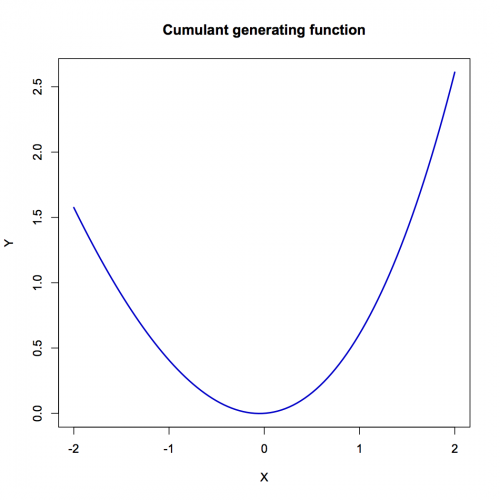

[](http://quantlet.de/index.php?p=info)

## [](http://quantlet.de/) **XFGVaRcgfDGtest** [](http://quantlet.de/d3/ia)

```yaml

Name of QuantLet : XFGVaRcgfDGtest

Published in : Applied Quantitative Finance

Description : 'Plots the cumulant generating function for a distribution, which is close to normal
distribution. The graph is close to a parabola.'

Keywords : Delta-Gamma-models, cumulant generating function, distribution, normal, plot

See also : VaRcgfDG, VaRcharfDG

Author : Awdesch Melzer

Submitted : Mon, June 03 2013 by Awdesch Melzer

Output : 'Plot of the cumulant generating function for a distribution, which is close to normal
distribution. The graph is close to a parabola.'

```




### R Code:
```r
rm(list = ls(all = TRUE))
graphics.off()

############################ SUBROUTINE ################################

VaRcgfDG = function(t, par) {
    # cumulant generating function (cgf) for the class of quadratic forms of Gaussian vectors.  Complex array generation
    compl = function(re, im) {
        if (missing(re)) {
            stop("compl: no composed object for real part")
        }
        if (missing(im)) {
            im = 0 * (re <= Inf)
        }
        if (nrow(matrix(re)) != nrow(matrix(im))) {
            stop("compl: dim(re)<>dim(im)")
        }
        z = list()
        z$re = re
        z$im = im
        return(z)
    }
    s = compl(par$theta * t$re, par$theta * t$im)
    cmul = function(x, y) {
        # Complex multiplication
        re = x$re * y$re - x$im * y$im
        im = x$re * y$im + x$im * y$re
        z = list()
        z$re = re
        z$im = im
        return(z)
    }
    cdiv = function(x, y) {
        # Complex division
        w = y$re^2 + y$im^2
        re = (x$re * y$re + x$im * y$im)/w
        im = (x$im * y$re - x$re * y$im)/w
        z = list()
        z$re = re
        z$im = im
        return(z)
    }
    cln = function(x) {
        # Complex natural logarithm
        re = log(x$re^2 + x$im^2)/2
        im = atan2(x$im, x$re)
        z = list()
        z$re = re
        z$im = im
        return(z)
    }
    csub = function(x, y) {
        # Complex subtraction two arrays of complex numbers
        re = x$re - y$re
        im = x$im - y$im
        z = list()
        z$re = re
        z$im = im
        return(z)
    }
    
    i = 1
    m = length(par$lambda)
    while (i <= m) {
        # 1-lambda*t:
        omlt = compl(1 - par$lambda[i] * t$re, -par$lambda[i] * t$im)
        tmp = cmul(t, t)
        tmp = cdiv(tmp, omlt)
        tmp = compl(par$delta[i]^2 * tmp$re, par$delta[i]^2 * tmp$im)
        tmp = csub(tmp, cln(omlt))
        s = compl(s$re + 0.5 * tmp$re, s$im + 0.5 * tmp$im)
        i = i + 1
    }
    return(s)
}

compl = function(re, im) {
    # Complex array generation
    if (missing(re)) {
        stop("compl: no composed object for real part")
    }
    if (missing(im)) {
        im = 0 * (re <= Inf)
    }
    if (nrow(matrix(re)) != nrow(matrix(im))) {
        stop("compl: dim(re)<>dim(im)")
    }
    z = list()
    z$re = re
    z$im = im
    return(z)
}

############################ Main Program ############################

XFGVaRcgfDGtest = function(par, n, xlim) {
    # test function
    dt = (xlim[2] - xlim[1])/(n - 1)
    t = xlim[1] + (0:(n - 1)) * dt
    r = VaRcgfDG(compl(t, t * 0), par)
    z1 = cbind(t, r$re)
    plot(z1, type = "l", col = "blue3", lwd = 2, xlab = "X", ylab = "Y")
    title("Cumulant generating function")
}

theta = 0
delta = c(1)
lambda = c(0.1)
par = list()
par$theta = theta
par$delta = delta
par$lambda = lambda
XFGVaRcgfDGtest(par, 100, c(-2, 2)) 

```
