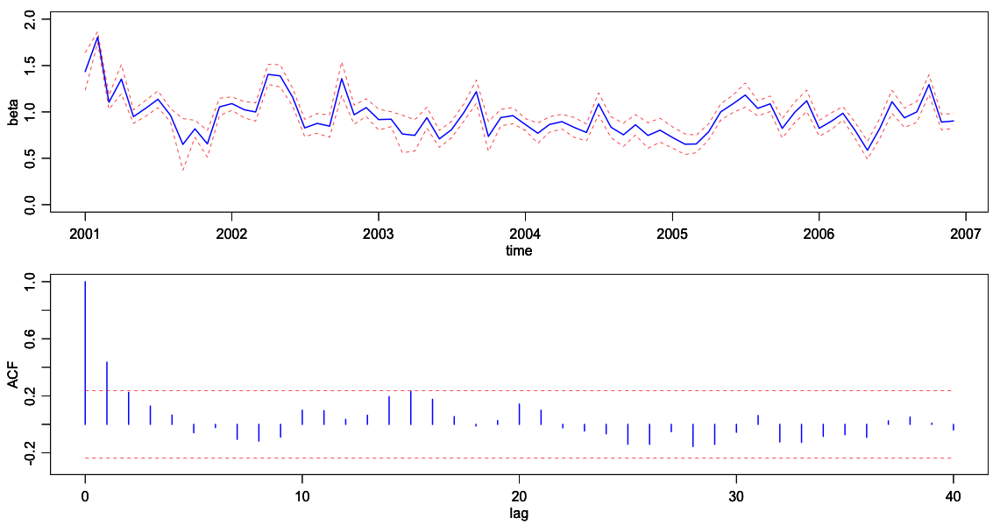

##  **XFGbetatsacf**


```yaml
Name of QuantLet : XFGbetatsacf

Published in : XFG3

Description : 'Plots ime evolvement and sample autocorrelation function for 
IBM.'

Keywords : 'acf, plot, graphical representation, volatility, autocorrelation'

See also : 

Author : Nicolas Hautsch

Submitted :

Datafile : ibmBeta.dat

Example :
- 'Time evolvement and sample autocorrelation function of realized volatility 
for IBM.'

```



```R

# clear history
rm(list = ls(all = TRUE))
graphics.off()


# read data
ibm = read.table("ibmBeta.dat", header = F, col.names = c("date", "beta", "conf"))

# save output as pdf
# pdf(file = "beta_ts_acf.pdf", paper = "special", width = 6, height = 6)
op = par(no.readonly = TRUE)

par(mgp = c(1.75, 0.75, 0))
par(mar = c(3, 3, 0.7, 0.7))
par(mfrow = c(2, 1))
plot(as.Date(as.character(ibm$date), "%Y%m%d"), ibm$beta, type = "l", xlab = "time", 
ylab = "beta", lwd = 2, col = "blue", ylim = c(0, 2))
par(new = T)
plot(as.Date(as.character(ibm$date), "%Y%m%d"), ibm$beta + ibm$conf, type = "l", 
xlab = "time", ylab = "beta", lwd = 1, col = "red", lty = 2, ylim = c(0, 2))
par(new = T)
plot(as.Date(as.character(ibm$date), "%Y%m%d"), ibm$beta - ibm$conf, type = "l", 
xlab = "time", ylab = "beta", lwd = 1, col = "red", lty = 2, ylim = c(0, 2))

acfData <- acf(ibm$beta, lag.max = 40, type = "correlation", plot = FALSE)
conf <- 2/sqrt(length(ibm$beta))

plot(acfData$lag, acfData$acf, type = "h", xlab = "lag", ylab = "ACF", lwd = 2, col = "blue", 
ylim = c(-0.3, 1))
par(new = T)
plot(acfData$lag, array(data = conf, dim = length(acfData$lag)), type = "l", xlab = "lag", 
ylab = "ACF", lwd = 1, col = "red", lty = 2, ylim = c(-0.3, 1))
par(new = T)
plot(acfData$lag, array(data = -conf, dim = length(acfData$lag)), type = "l", xlab = "lag", 
ylab = "ACF", lwd = 1, col = "red", lty = 2, ylim = c(-0.3, 1))

#par(op)
#dev.off() 

```
