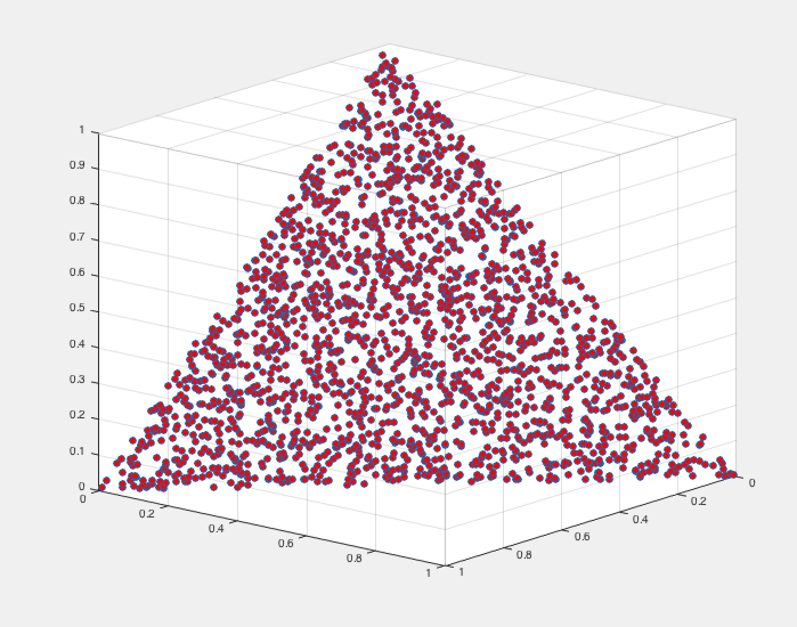
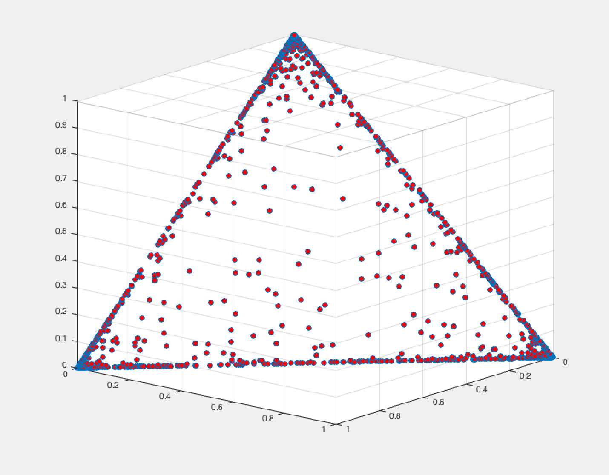
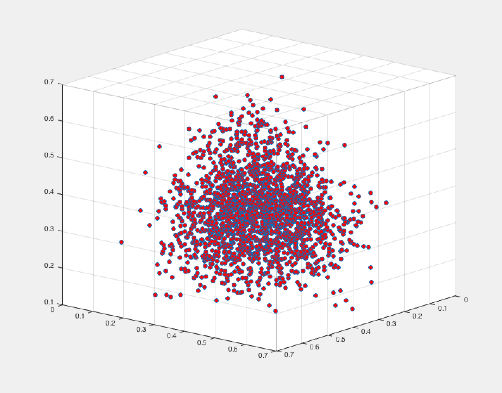
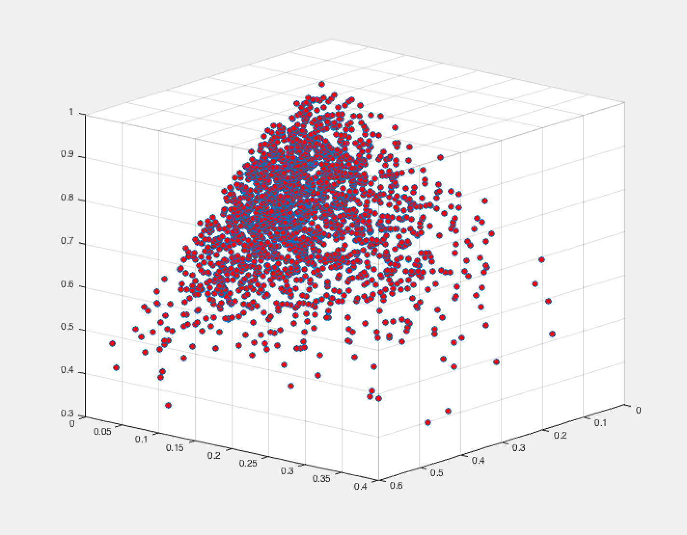

[](http://quantlet.de/)

## [](http://quantlet.de/) **XFGdtmDirichlet** [](http://quantlet.de/)

```yaml

Name of Quantlet : XFGdtmDirichlet

Published in : Applied Quantitative Finance (3rd Edition)

Description : Simulates and plots the Dirichlet distribution with various values for alpha.

Keywords : simulation, distribution, plot, graphical representation, visualization

Author : Ernie Teo

```










### MATLAB Code:
```matlab
n = 2000;

% Plot 1
a = [1 1 1];
r = drchrnd(a,n);

HD        = scatter3(r(:,1),r(:,2),r(:,3),'MarkerFaceColor',[1 0 0]);
direction = [0 0 1];
view(-40,-18)

% Plot 2
a = [.1 .1 .1];
r = drchrnd(a,n);
HD        = scatter3(r(:,1),r(:,2),r(:,3),'MarkerFaceColor',[1 0 0]);
direction = [0 0 1];
view(-40,-18)

% Plot 3
a = [10 10 10];
r = drchrnd(a,n);
HD        = scatter3(r(:,1),r(:,2),r(:,3),'MarkerFaceColor',[1 0 0]);
direction = [0 0 1];
view(-40,-18)

% Plot 4
a = [2 5 15];
r = drchrnd(a,n);
HD        = scatter3(r(:,1),r(:,2),r(:,3),'MarkerFaceColor',[1 0 0]);
direction = [0 0 1];
view(-40,-18)
```
