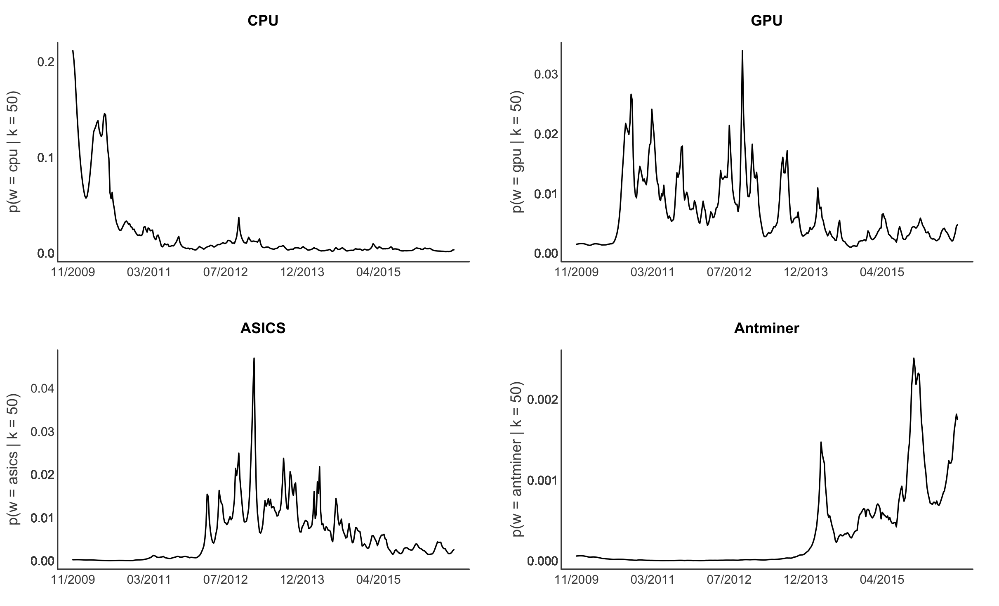

[](http://quantlet.de/)

## [](http://quantlet.de/) **XFGdtmMining** [](http://quantlet.de/)

```yaml

Name of Quantlet : XFGdtmMining

Published in : Applied Quantitative Finance (3rd Edition)

Description : Plots word evolution for different cryptocurrency mining technologies.

Keywords : plot, graphical representation, visualization, crypto, text mining

Author : Marco Linton

```




### R Code:
```r
options(stringsAsFactors = FALSE)

setwd("")

data.df      = read.csv("term_evolution.csv")
data.df$date = sapply(strsplit(data.df$date, " "), "[", 1)
data.df$date = as.Date(data.df$date, "%Y-%m-%d")

dev.new(width = 10, height = 6)
par(mar = c(3, 4.1, 3, 2.1), mfrow = c(2, 2))

# CPU
plot(data.df$cpu,
     main = "CPU",
     lwd  = 2, 
     col  = "black",
     bty  = 'l',
     xaxt = "n",
     yaxt = "n",
     xlab = "",
     ylab = "",
     type = "l",
     xlim = c(min(data.df$date), max(data.df$date)),
     ylim = c(0, max(data.df$cpu)))

lines(data.df$date, data.df$cpu, lwd = 1.5)

box(lwd = 1.5, bty  = 'l', col = "gray22")

mtext("p(w = cpu | k = 50)", 
      side = 2,
      line = 2.5, 
      cex  = 1, 
      col  = "gray22",
      las  = 3)

axis(side     = 2, 
     round(data.df$cpu, 1),
     tick     = FALSE, 
     cex.lab  = 1, 
     line     = -0.8, 
     col.axis = "gray22",
     las      = 1)

axis(side     = 1, 
    data.df$date, format(data.df$date, "   %m/%Y   "),
     tick     = FALSE, 
     cex.lab  = 0.1, 
     line     = -0.8, 
     col.axis = "gray22",
     las      = 1)

# GPU
plot(data.df$gpu,
     main = "GPU",
     lwd  = 2, 
     col  = "black",
     bty  = 'l',
     xaxt = "n",
     yaxt = "n",
     xlab = "",
     ylab = "",
     type = "l",
     xlim = c(min(data.df$date), max(data.df$date)),
     ylim = c(0, max(data.df$gpu)))

lines(data.df$date, data.df$gpu, lwd = 1.5)

box(lwd = 1.5, bty  = 'l', col = "gray22")

mtext("p(w = gpu | k = 50)", 
      side = 2,
      line = 2.5, 
      cex  = 1, 
      col  = "gray22",
      las  = 3)


axis(side     = 2, 
     round(data.df$gpu, 2),
     tick     = FALSE, 
     cex.lab  = 1, 
     line     = -0.8, 
     col.axis = "gray22",
     las      = 1)

axis(side     = 1, 
     data.df$date, format(data.df$date, "   %m/%Y   "),
     tick     = FALSE, 
     cex.lab  = 1, 
     line     = -0.8, 
     col.axis = "gray22",
     las      = 1)

# asics
plot(data.df$asics,
     main = "ASICS",
     lwd  = 2, 
     col  = "black",
     bty  = 'l',
     xaxt = "n",
     yaxt = "n",
     xlab = "",
     ylab = "",
     type = "l",
     xlim = c(min(data.df$date), max(data.df$date)),
     ylim = c(0, max(data.df$asics)))

lines(data.df$date, data.df$asics, lwd = 1.5)

box(lwd = 1.5, bty  = 'l', col = "gray22")

mtext("p(w = asics | k = 50)", 
      side = 2,
      line = 2.5, 
      cex  = 1, 
      col  = "gray22",
      las  = 3)

axis(side     = 2, 
     round(data.df$asics, 2),
     tick     = FALSE, 
     cex.lab  = 1, 
     line     = -0.8, 
     col.axis = "gray22",
     las      = 1)

axis(side     = 1, 
     data.df$date, format(data.df$date, "   %m/%Y   "),
     tick     = FALSE, 
     cex.lab  = 1, 
     line     = -0.8, 
     col.axis = "gray22",
     las      = 1)

# adminer
plot(data.df$aminer,
     main = "Antminer",
     lwd  = 2, 
     col  = "black",
     bty  = 'l',
     xaxt = "n",
     yaxt = "n",
     xlab = "",
     ylab = "",
     type = "l",
     xlim = c(min(data.df$date), max(data.df$date)),
     ylim = c(0, max(data.df$aminer)))

lines(data.df$date, data.df$aminer, lwd = 1.5)

box(lwd = 1.5, bty  = 'l', col = "gray22")

mtext("p(w = antminer | k = 50)", 
      side = 2,
      line = 2.5, 
      cex  = 1, 
      col  = "gray22",
      las  = 3)

axis(side     = 2, 
     round(data.df$aminer, 3),
     tick     = FALSE, 
     cex.lab  = 1, 
     line     = -0.8, 
     col.axis = "gray22",
     las      = 1)

axis(side     = 1, 
     data.df$date, format(data.df$date, "   %m/%Y   "),
     tick     = FALSE, 
     cex.lab  = 1, 
     line     = -0.8, 
     col.axis = "gray22",
     las      = 1)

```
