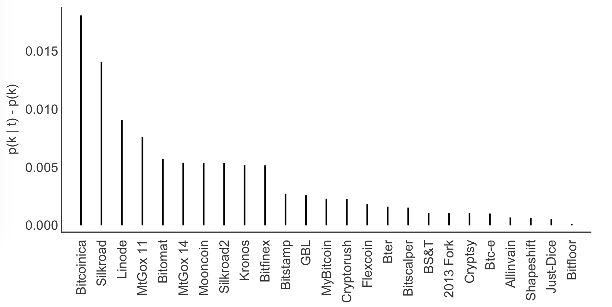

[](http://quantlet.de/)

## [](http://quantlet.de/) **XFGdtmTemperature** [](http://quantlet.de/)

```yaml

Name of Quantlet : XFGdtmTemperature

Published in : Applied Quantitative Finance (3rd Edition)

Description : Plots the temperature of different events relevant for the crypto-currency market.

Keywords : plot, graphical representation, visualization, crypto, text mining

Author : Marco Linton

```




### R Code:
```r
options(stringsAsFactors = FALSE)

setwd("")

data.df = read.csv("events30.dat", sep = " ")
data.df = data.df[order(-data.df$heat), ]
data.df = data.df[data.df$heat != 0, ]

dev.new(width = 8, height = 4)

par(mar = c(5, 4.1, 0.5, 2.1), mfrow = c(1, 1), lend = 1)

plot(data.df$heat,
     main = "",
     lwd  = 2, 
     col  = "black",
     bty  = 'l',
     xaxt = "n",
     yaxt = "n",
     xlab = "",
     ylab = "",
     type = "h")

box(lwd = 1.5, bty  = 'l', col = "gray22")

axis(1, at = 1:length(data.df$label), 
    labels = data.df$label, 
    cex.axis = 1, las = 3, col.axis = "gray22",
    tick = FALSE, line = -0.5)

axis(side     = 2, 
     tick     = FALSE, 
     cex.lab  = 1, 
     line     = -0.8, 
     col.axis = "gray22",
     las      = 1)

mtext("p(k | t) - p(k)", 
      side = 2,
      line = 2.7, 
      cex  = 1, 
      col  = "gray22",
      las  = 3)

```
