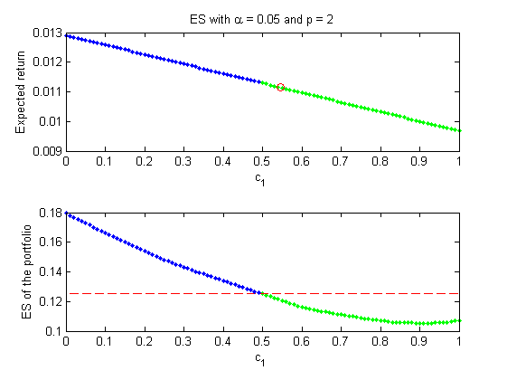

[](http://quantlet.de/index.php?p=info)

## [](http://quantlet.de/) **XFGexp_rtn_ES_2d** [](http://quantlet.de/d3/ia)

```yaml

Name of QuantLet : XFGexp_rtn_ES_2d

Published in : XFG (3rd Edition)

Description : 'Computes the values of the expected returns and the ES of the optimal portfolios
with different holding weights for the 1st underlying asset under an EGARCH(1,1) model, where the
number of assets is 2.'

Keywords : expected shortfall, garch, linear programming, portfolio, risk aversion, risk measure

Author : Shih-Feng Huang

Datafile : None

Example : 'The values of the expected returns and the ES of the optimal portfolios with different
holding weights c1 of the 1st underlying asset under an EGARCH(1,1) model, where the number of
assets is 2 and T = 250.'

```




```matlab

```
