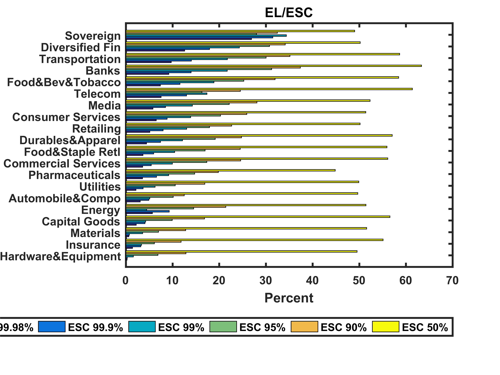
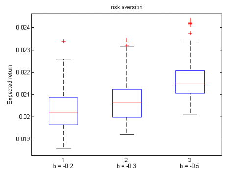
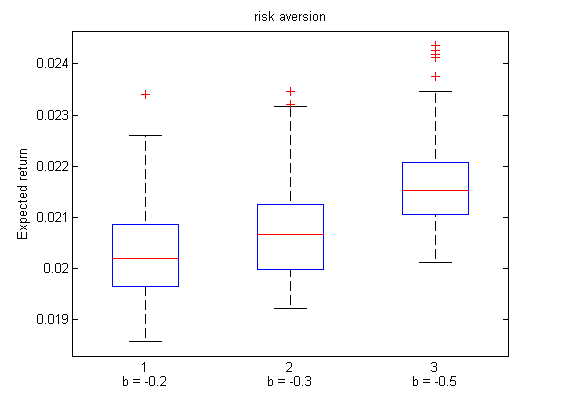

[](http://quantlet.de/index.php?p=info)

## [](http://quantlet.de/) **XFGexp_rtn_SRM** [](http://quantlet.de/d3/ia)

```yaml

Name of QuantLet : XFGexp_rtn_SRM

Published in : Applied Quantitative Finance

Description : 'computes the optimal expected returns with a generating function of the SRM related
to the HARA utility'

Keywords : Linear programming, garch, portfolio, risk aversion, risk measure

See also : XFGTWSE100_strategy_fixedESlevel, XFGexp_rtn_ES_2d, XFGexp_rtn_SRM_2d

Author : Shih-Feng Huang, Hsiao-Chi Lin, Tze-Yun Lin, Alla Petukhina

Submitted : Thu, August 06 2015 by Sergey Nasekin

Input : None

Output : '- boxplots of the optimal expected returns with a generating function of the spectral
risk measure (SRM) related to the HARA utility with different risk levels.'

Example : boxplots of the optimal expected returns

```








### MATLAB Code:
```matlab
clear all; tic;
p      = 30;  % # of assets                    
T      = 350; % # of dates

% Parameter setting
Offset = 0.01 * ones(1,p);
theta  = 0.02 * ones(1, p);
% EGARCH
k      = -0.3 * ones(1, p);   % Constant
garch  = 0.95 * ones(1,p);    % GARCH
arch   = 0.1776 * ones(1, p); % ARCH
L      = -0.05 * ones(1, p);  % Leverage

% Generate random returns
mu = zeros(1, p);
for m = 1:p
    sigma2(1, m) = exp(k(m)/(1-garch(m)));  
end
SIGMA = eye(p);
rho   = 0.5;             
for i = 1:length(mu)-1
    SIGMA(i,i+1) = rho*sqrt(SIGMA(i,i)*SIGMA(i+1,i+1));
    SIGMA(i+1,i) = SIGMA(i,i+1);
end

move   = 250; % use the past 250 historical data to fit model
degree = 10;
nu     = degree;
q      = 10;  % use q step functions to approximate the generating function 
              % of a SRM     
              
E      = 2*sqrt((degree-2)/pi)*gamma((degree+1)/2)/gamma(degree/2)/(degree-1);
ep     = 0.0001;             % The epsilon in the HARA utility function
b      = [-0.2, -0.3, -0.5]; % different levels of the HARA utility

% Compute the expected returns under SRM with HARA utility
sum_flag = 0;
TT       = T;
epsilon  = mvtrnd(SIGMA, degree, TT); % multivariate t 
for m = 1:p
    r(1, m) = Offset(1) + sqrt(sigma2(1))*epsilon(1,m);
    for i = 2:TT
        sigma2(i, m) =...
            exp( garch(m) * log(sigma2(i-1, m)) +...
            k(m) + L(m) * epsilon(i-1, m) +...
            arch(m) * (abs(epsilon(i-1, m))- E) );        
        r(i, m)      =...
            Offset(m) + theta(m) * r(i-1) +...
            sqrt(sigma2(i, m))*epsilon(i, m); % rtn
    end
end

% Model fitting
spec = garchset('VarianceModel','EGARCH','R',1,'P',1,'Q',1,'Dist','t');
spec = garchset(spec, 'Display', 'off');
for z = 1:TT-move+1
    z
    rt = r(z:z+move-1, 1:p);
    for m = 1:p
        [coeff(m), errors(m), LLF, Innovations, Sigmas] =...
            garchfit(spec, rt(:, m));
        hat_phi0(m)       = coeff(1, m).C;        % phi0
        hat_phi1(m)       = coeff(1, m).AR;       % phi1
        hat_epsilon(:, m) = Innovations./Sigmas;  
        S(m, m)           = Sigmas(end);            
    end
    B = zeros(p, p);
    for ii = 1 : p
        B(ii, ii) = r(move, ii);
    end
    R = hat_phi0' + (hat_phi1 * B)'; % Expected returns
    % The upper bound of the risk
    Weight1       = ones(1, p)/p;
    hat_epsilon_p = hat_epsilon * S * Weight1';
    for j = 1:q+1   
        if j > 1
            alpha(j) = (q - j + 1)/q;
        else
            alpha(j) = 0.99;
        end
    end
    for ib = 1:length(b)
        [z ib] 
        g = b(ib)*log(ep) - (1+b(ib)) * log(1+b(ib)) + (1+b(ib)) - ep;
        for j=1:q 
            var1(j)      = -prctile(hat_epsilon_p, alpha(j) * 100); % xi*
            ES_alpha1(j) = -sum(hat_epsilon_p(-hat_epsilon_p > var1(j)))/...
                           (move * alpha(j));  % ES* > 0
            if j > 1
                if (alpha(j) < ep - b(ib))
                    phi1_1(j) = -log(ep)/g; 
                else     
                    phi1_1(j) = -log(alpha(j)+b(ib))/g;
                end
                if (alpha(j+1) < ep - b(ib))
                    phi2_1(j) = -log(ep)/g; 
                else     
                    phi2_1(j) = -log(alpha(j+1)+b(ib))/g;
                end
                w(j) = alpha(j) * (phi2_1(j)-phi1_1(j));     
            end
            if j == 1
                if (alpha(2) < ep - b(ib))
                    phi1_1(j) = -log(ep)/g;
                else     
                    phi1_1(j) = -log(alpha(2)+b(ib))/g;
                end
                w(j) = alpha(j) * phi1_1(j);
            end
        end
        w1    = w/sum(w);
        aaa   = w1./(move * alpha(1:q));
        SRM1  = w1 * ES_alpha1(1:q)';  % SRM*
        SRMf1 = -R' * Weight1' + SRM1; % The SRM of the portfolio      
        f     = [zeros(1, q), -R' zeros(1, q*move)];    % loss
        lb    = [-10^6*ones(q, 1); zeros(p+q*move,1)];  % weights >= 0
        bb    = [1; SRMf1; zeros(q*move,1)];            % L = SRM1 
        % The matrix A 
        A             = zeros(q*move + 2,q+q*move + p);  
        A(1, q+1:p+q) = 1;           
        A(2,1:q)      = w1;          
        A(2,q+1:q+p)   = -sum(w1)*R;  
        for j = 1 : q 
            A(2,p+q+(j-1)*move + 1 : q+j*move + p)      = aaa(j);   
            A((j-1)*move + 2 + 1 : j*move + 2, q+1:q+p) = ...
                -hat_epsilon(1:move, :) * S;
            A(2+(j-1)*move + 1:2+j*move,j)              = -1;
        end
        A(3:q*move + 2, q+p+1:q+p+q*move) = -eye(q*move);
        % Linear programing
        [WW, min, exitflag] = linprog(f, A, bb ,[], [], lb);
        if exitflag == 1
            weight1     = WW(q+1:q+p);  % Estimated weights
            Min_b(ib,z) = -min;                   
        end       
    end
end

figure(1)
boxplot(Min_b','Labels',{'b = -0.2','b = -0.3','b = -0.5'})
hold on;
plot([0, 31], [0.21 0.21], 'g-')
hold off;
title('risk aversion');
ylabel('Expected return');

toc;
```
