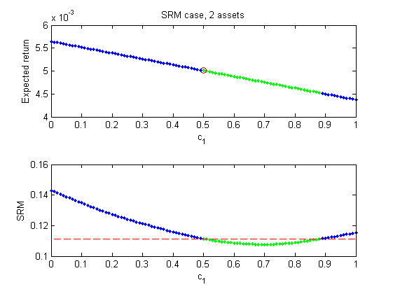

[](http://quantlet.de/index.php?p=info)

## [](http://quantlet.de/) **XFGexp_rtn_SRM_2d** [](http://quantlet.de/d3/ia)

```yaml

Name of QuantLet : XFGexp_rtn_SRM_2d

Published in : XFG (3rd Edition)

Description : 'Computes the values of the expected returns and the SRM with power utility of the
optimal portfolios with different holding weights for the 1st underlying asset under an EGARCH(1,1)
model, where the number of assets is 2.'

Keywords : garch, linear programming, portfolio, risk aversion, risk measure

Author : Shih-Feng Huang

Datafile : None

Example : 'The values of the expected returns and the SRM with power utility of the optimal
portfolios with different holding weights c1 of the 1st underlying asset under an EGARCH(1,1)
model, where the number of assets is 2 and T = 250.'

```




```matlab
%-------------------------------------------------------------------------------
% Book: Applied Quantitative Finance
%-------------------------------------------------------------------------------
% Quantlet: exp_rtn_SRM_2d
%-------------------------------------------------------------------------------
% Description: Compute the values of the expected returns and the SRM of the 
%              optimal portfolios with different holding weights for the 1st 
%              underlying asset under an EGARCH(1,1) model, where the number 
%              of assets is 2.
%-------------------------------------------------------------------------------
% Usage: None
%-------------------------------------------------------------------------------
% Inputs: None
%-------------------------------------------------------------------------------
% Output: Plots of the expected returns and the SRM of the optimal portfolios 
%         with different holding weights of the 1st underlying asset
%         under an EGARCH(1,1) model, where the number of assets is 2.
%-------------------------------------------------------------------------------
% Keywords: garch, linear programming, portfolio, risk aversion, risk measure  
%-------------------------------------------------------------------------------
% Author: Huang, S.F., Lin, H.C. and Lin, T.Y 
%-------------------------------------------------------------------------------
%-------------------------------------------------------------------------------
% Datafile: None
%-------------------------------------------------------------------------------

clear all; tic;
p     = 2;                  % number of assets 
T     = 250;
alpha = 0.05;
% Model parameters
Offset = [0.01, 0.0105];    % constant in the AR model
theta  = [0.02, 0.0199];    % AR(1) coefficient

% EGARCH
k      = [-0.3, -0.3];      % The (1-\alpha)\alpha_0 in Tsay (2010) (3.26) 
garch  = [0.95, 0.95];      % The \alpha in Tsay (2010) (3.26)  
arch   = [0.1776, 0.1776];  % The \gamma in Tsay (2010) (3.24)  
L      = [-0.05, -0.05];    % The \theta in Tsay (2010) (3.24)  

% Generate random data
mu = zeros(1, p);
for m = 1:p
    sigma2(1, m) = exp(k(m)/(1-garch(m)));  
end
SIGMA = eye(p);
rho   = 0.5;             
for i = 1:length(mu)-1
    SIGMA(i,i+1) = rho*sqrt(SIGMA(i,i)*SIGMA(i+1,i+1));
    SIGMA(i+1,i) = SIGMA(i,i+1);
end

% t-distribution
degree = 10;
E = 2*sqrt((degree-2)/pi)*gamma((degree+1)/2)/gamma(degree/2)/(degree-1);

nu = degree; % The risk aversion parameter of the CARA utility function
q  = 10;     % The number of intervals used to approximate the generating 
             % function of a SRM

ite      = 1;
sum_flag = 0;
while sum_flag < ite
    epsilon = mvtrnd(SIGMA, degree, T); % multivariate t 
    for m = 1:p
        r(1, m) = Offset(1) + sqrt(sigma2(1))*epsilon(1,m);
        for i = 2:T
            sigma2(i, m) =...
                exp( garch(m) * log(sigma2(i-1, m)) +...
                     k(m) + L(m) * epsilon(i-1, m) +...
                     arch(m) * (abs(epsilon(i-1, m))- E) );        
            r(i, m) = Offset(m) + theta(m) * r(i-1) +...
                      sqrt(sigma2(i, m))*epsilon(i, m); % return
        end
    end
    SORT_r = sort(r);

  % Model estimation
    spec = garchset('VarianceModel','EGARCH','R',1,'P',1,'Q',1,'Dist','t');
    spec = garchset(spec, 'Display', 'off');
    for m = 1:p
        [coeff(m), errors(m), LLF, Innovations, Sigmas] =...
            garchfit(spec, r(:, m));
        hat_phi0(m) = coeff(1, m).C;        % phi0
        hat_phi1(m) = coeff(1, m).AR;       % phi1
        hat_epsilon(:, m) = Innovations./Sigmas;  
        S(m, m) = Sigmas(end);
    end
   
    B = zeros(p, p);
    for ii = 1 : p
        B(ii, ii) = r(T, ii);
    end
    R = hat_phi0' + (hat_phi1 * B)'; % expected return
    
  % Compute the upper bound of the risk
    Weight1 = [0.5 0.5];
    hat_epsilon_p = hat_epsilon * S * Weight1';  

    for j = 1:q+1   
        if j > 1
            alpha(j) = (q - j + 1)/q;
        else
            alpha(j) = 0.99;
        end
    end
       
    for j=1:q 
       % \xi*, VaR of -\kappa
        var1(j)      = -prctile(hat_epsilon_p, alpha(j) * 100); 
       % ES > 0, ES*, ES of -\kappa 
        ES_alpha1(j) = -sum(hat_epsilon_p(-hat_epsilon_p > var1(j)))/...
                       max(T * alpha(j),10^(-8));  
        if j > 1
            phi1_1(j) = nu * exp(-nu * (alpha(j)))/(1-exp(-nu));     % phi
            phi2_1(j) = nu * exp(-nu * (alpha(j+1)))/(1-exp(-nu));   % phi
            w(j)      = alpha(j) * (phi2_1(j)-phi1_1(j));     
        end
        if j == 1
            phi1_1(j) = nu * exp(-nu * alpha(2))/(1-exp(-nu));       % phi
            w(j)      = phi1_1(j);
        end
    end
    w1 = w/sum(w);
    aaa = w1./(T * alpha(1:q));
    SRM1 =  w1 * ES_alpha1(1:q)';
    SRMf1 = -R' * Weight1' + SRM1;   % for portfolio
    
  % Linear programming
    f  = [zeros(1, q), -R' zeros(1, q*T)];      
    lb = [-10^6*ones(q, 1); zeros(p+q*T,1)];    
    b  = [1; SRMf1; zeros(q*T,1)];              
    
    A  = zeros(q*T+2,q+q*T+p);  
    A(1,q+1:p+q) = 1;           
    A(2,1:q)     = w1;          
    A(2,q+1:q+p) = -sum(w1)*R;  
    for j = 1 : q 
        A(2,p+q+(j-1)*T+1 : q+j*T+p)    = aaa(j);   
        A((j-1)*T+2+1 : j*T+2, q+1:q+p) = -hat_epsilon(1:T, :) * S;
        A(2+(j-1)*T+1:2+j*T,j)          = -1;
    end
    A(3:q*T+2,q+p+1:q+p+q*T) = -eye(q*T);
 
    [ww, minf, exitflag] = linprog (f, A, b ,[], [], lb);   
    
    weight_SUM = 0;
    if exitflag == 1
        weight(:,1) = ww(q+1:q+p);  % Optimal weights obtained from the LP
        weight_SUM  = sum(weight)   % Sum of the weights of the optimal 
                                    % portfolio obtained from the LP        
    end
    
    % Note that in this demonstration, we focus on the case of c_1 + c_2 =1 
    % for comparison. In general, this constraint is not necessary. 
    if weight_SUM > 0.9999
        sum_flag  = sum_flag+1;
    end
end

% Different combination of the investment weights
c1 = 0:0.01:1;
c2 = 1-c1;
for mm = 1 : length(c1)
    % Compute the expected returns under different weights
    rrr(mm) = [c1(mm) c2(mm)] * R;
    Weight = [c1(mm) c2(mm)];
    epsilon_t1 = hat_epsilon * S * Weight';
    
    for j = 1:q   
        var2(mm, j)      = -prctile(epsilon_t1, alpha(j) * 100); 
        ES_alpha2(mm, j) = -sum(epsilon_t1(-epsilon_t1 > var2(mm, j)))/...
                           max(T * alpha(j),10^(-8));                
    end
    SRM2(mm)  = w1 * ES_alpha2(mm, 1:q)'; 
    SRMf2(mm) = -R' * Weight' + SRM2(mm); % for portfolio
end

figure(1)
y4_index(:,1) = 1:101;
y4_index(:,2) = (SRMf2 > SRMf1);
y4_i1 = y4_index(y4_index(:,2)==1,1);

subplot(2, 1, 1);
x = 0:0.01:1;
x3 = ww(q+1);% Optimal weights of the 1st asset obtained from the LP
y1 = rrr;    % Expected returns under different weights
y3 = -minf;  % Expected return of the optimal portfolio obtained from the LP

plot(x, y1, 'g.', x3, y3, 'rO', x(y4_i1), rrr(y4_i1), 'b.');
title('SRM case, 2 assets');
xlabel('c_1');
ylabel('Expected return');

subplot(2, 1, 2);
y1 = SRMf2;                      % The values of ES under different weights
y2 = SRMf1*ones(1, length(c1));  % The upper bound of the risk constraint

plot(x, y1, 'g.', x, y2, 'r--', x(y4_i1), y1(y4_i1), 'b.');
xlabel('c_1');
ylabel('SRM');

toc;


```
