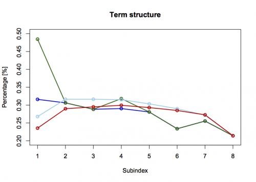

[](http://quantlet.de/index.php?p=info)

## [](http://quantlet.de/) **XFGiv03** [](http://quantlet.de/d3/ia)

```yaml

Name of QuantLet : XFGiv03

Published in : Applied Quantitative Finance

Description : 'XFGiv03 shows the term structure of implied volatility indices. These indices,
representing different option maturities, measure volatility implied in ATM European call and put
options. The VDAX calculations are based on Black and Scholes formula. Term structures for ATM DAX
options can be derived from VDAX subindices for any given trading day since 18 March 1996. Shapes
of the term structure on subsequent trading days are shown in a plot. If we compare the volatility
structure of 27 October 1997 (blue line) with that of 28 Octorber 1997 (green line), we easily
notice an overnight upward shift in the levels implied volatilities. In addition, it displays an
inversion as short term volatilities are higher than long term ones. Only a couple of weeks later,
on 17 November (skyblue line) and 20 November (red line), the term structure had normalized at
lower levels and showed its typical shape again. Apparently, during the market tumble in fall 1997,
the ATM term structure shifted and changed its shape considerably over time.'

Keywords : 'black-scholes, call, european-option, implied-volatility, option, option-price, put,
term structure'

See also : XFGLSK, XFGiv00, XFGiv01, XFGiv02, XFGiv04, XFGiv05, XFGiv06

Author : Awdesch Melzer

Submitted : Wed, May 28 2014 by Awdesch Melzer

Datafiles : XFGIVTermStructure.dat

```




### R Code:
```r
# clear cache and close graphs
rm(list=ls(all=TRUE))
graphics.off()

# setwd("C:/...")

x  = read.table("XFGIVTermStructure.dat") # load data

x1 = cbind(1:8,x[,1])                    # prepare for plotting
x2 = cbind(1:8,x[,2])
x3 = cbind(1:8,x[,3])
x4 = cbind(1:8,x[,4])

plot(x1,type="l",col="blue3",ylim=c(0.20,0.5),lwd=2,xlab="Subindex",ylab="Percentage [%]")
lines(x2,col="darkgreen",lwd=2)
lines(x3,col="skyblue",lwd=2)
lines(x4,col="red3",lwd=2)
title("Term structure")
points(x1,pch=1,col="blue3",lwd=2)         # setting points
points(x2,pch=1,col="darkgreen",lwd=2)
points(x3,pch=1,col="skyblue",lwd=2)
points(x4,pch=1,col="red3",lwd=2)
```
