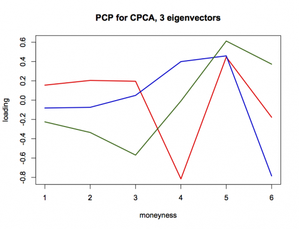

[](http://quantlet.de/index.php?p=info)

## [](http://quantlet.de/) **XFGiv06** [](http://quantlet.de/d3/ia)

```yaml

Name of QuantLet : XFGiv06

Published in : Applied Quantitative Finance

Description : 'Estimates a common principle components model for the implied volatility data
(XFGvolsurf01.dat, XFGvolsurf02.dat, XFGvolsurf03.dat) and computes a likelihood ratio test.'

Keywords : 'CPC, MLE, common-principal-component, dimension-reduction, implied-volatility,
likelihood ration, maximum-likelihood'

See also : MVAcpcaiv, XFGLSK, XFGiv00, XFGiv01, XFGiv02, XFGiv03, XFGiv04, XFGiv05

Author : Zografia Anastasiadou

Submitted : Wed, May 28 2014 by Awdesch Melzer

Datafiles : XFGvolsurf01.dat, XFGvolsurf02.dat, XFGvolsurf03.dat

```




### R Code:
```r
rm(list=ls(all=TRUE))
graphics.off()

# install.packages("gRapHD")
library(gRapHD)

# 1 month maturity data
data1   = read.table("XFGvolsurf01.dat") 
# 2 months maturity data
data2   = read.table("XFGvolsurf02.dat")
# 3 months maturity data
data3   = read.table("XFGvolsurf03.dat") 

# sample covariance*10^5 of 1 month maturity data
S1      = cov(data1)*1e5  
# sample covariance*10^5 of 2 months maturity data       
S2      = cov(data2)*1e5  
# sample covariance*10^5 of 3 months maturity data       
S3      = cov(data3)*1e5  

# combine data by rows       
S       = rbind(S1,S2,S3) 
# create a 3d array        
A       = array(t(S),c(ncol(S1),ncol(S2),3))
# number of trading days in 1999   
n       = c(253,253,253)          
N       = n-1

# precision for maximum deviation of an element of matrix B 
preB    = 1e-10	
# maximal number of iteration	    
maxit   = 15
#precision for maximum deviation of an element of matrix Q
preQ    = 1e-10
# maximal number of iteration		 
maxiter = 10
# covariances are pxp		
p       = dim(A)[1]	
# number of groups	
k       = dim(A)[3]	
# initial value for B, the unit matrix	
B       = diag(p)	  
     
f       = 0
repeat{
    f       = f+1
    Bold    = B  
    j       = 1
    while (j<=p){ 
        m   = 1
        while (m<j){
            Bmj    = cbind(B[,m],B[,j])
            T      = array(0,c(2,2,k))
            T
            T[,,1] = t(Bmj)%*%A[,,1]%*%Bmj
            T[,,2] = t(Bmj)%*%A[,,2]%*%Bmj
            T[,,3] = t(Bmj)%*%A[,,3]%*%Bmj
            Q      = cbind(c(1,0),c(0,1))   # orthogonal matrix to start with
            g      = 0
            repeat{
                g          = g+1
                Qold       = Q
                Delta1     = array(Q,c(2,2,k))*T*(array(Q,c(2,2,k)))
                diag(Delta1[ , ,1])
                Delta      = array(c(diag(Delta1[,,1])), c(2,1,3))
                Delta[,,1] = c(diag(Delta1[,,1]))
                Delta[,,2] = c(diag(Delta1[,,2]))
                Delta[,,3] = c(diag(Delta1[,,3]))             
                a          = t(Delta[,,1])
                b          = t(Delta[,,2])
                c          = t(Delta[,,3])
                abc        = matrix(cbind(a,b,c),2,3)
                abcd       = t(abc)
                d          = N*(abcd[,1]-abcd[,2])/(abcd[,1]*abcd[,2])
                Tsum1      = array(0, c(2,2,k))
                Tsum1[,,1] = d[1]*T[,,1]
                Tsum1[,,2] = d[2]*T[,,2]
                Tsum1[,,3] = d[3]*T[,,3]
                f          = sum(Tsum1[,1,][1,])
                g          = sum(Tsum1[,1,][2,])
                h          = sum(Tsum1[,2,][1,])
                y          = sum(Tsum1[,2,][2,])
                Tsum       = matrix(rbind(f,g,h,y),2,2)
                e          = eigen(Tsum)     # spectral decomposition
                Q          = e$vectors       # find eigenvectors of Tsum
                maxim      = max(abs(Q-Qold))
                if ((maxim<preQ)|(g>maxiter)) break
            }  
            J      = diag(p)
            J[m,m] = Q[1,1]
            J[m,j] = Q[1,2]
            J[j,m] = Q[2,1]
            J[j,j] = Q[2,2]
            B      = B%*%J
            m      = m+1
            print(m)
        }
        j      = j+1
    }
    maximum  = max(abs(B-Bold))
    if ((maximum<preB)|(f>maxit)) break
}
    
lambda1     = array(t(B),c(p,p,k))*A*(array(B,c(p,p,k)))
lambda      = array(c(diag(lambda1[,,1])), c(p,1,3))
lambda[,,1] = c(diag(lambda1[,,1]))
lambda[,,2] = c(diag(lambda1[,,2]))
lambda[,,3] = c(diag(lambda1[,,3]))
a1b1c1      = matrix(cbind(t(lambda[,,1]),t(lambda[,,2]),t(lambda[,,3])),p,k) 

# sort eigenvectors according to size of its corresponding eigenvalues
u           = rbind(t(a1b1c1),B)
us          = t(u)
us          = us[order(us[,1]), ]
uss         = us[p:1,]
B           = t(uss[,(k+1):(k+p)])
BB          = t(B[,1:k])
BB[2,]      = BB[2,]*(-1)

plot(BB[1,],type="l",lwd=2,col="red",ylim=c(min(BB[1:3,]),max(BB[1:3,])),xlab="moneyness",ylab="loading",main="PCP for CPCA, 3 eigenvectors")
lines(BB[2,],type="l",lwd=2,col="blue3")
lines(BB[3,],type="l",lwd=2,col="darkgreen")

# estimated population covariances
V           = array(0,c(p,p,k))
V[,,1]      = uss[,1]*diag(p)
V[,,2]      = uss[,2]*diag(p)
V[,,3]      = uss[,3]*diag(p)
psi         = array(0,c(p,p,k))
psi[,,1]    = B%*%V[,,1]%*%t(B)
psi[,,2]    = B%*%V[,,2]%*%t(B)
psi[,,3]    = B%*%V[,,3]%*%t(B)

# test statistic
de          = c(det(psi[,,1]),det(psi[,,2]),det(psi[,,3]))
det         = c(det(A[,,1]),det(A[,,2]),det(A[,,3]))
test        = 2*log(t(n-1)%*%(de/det))
test

# p-value
df          = 1/2*(k-1)*p*(p-1)
df
t           = 1-pchisq(test,df)
t

```
