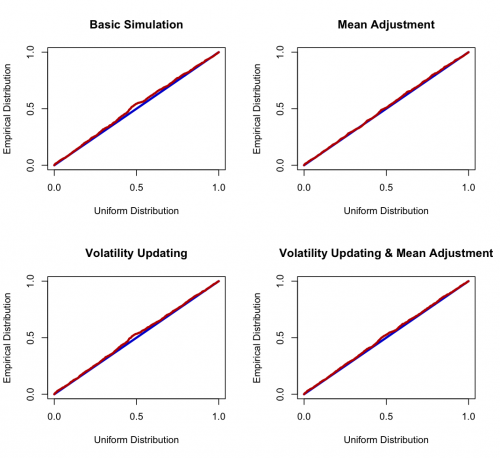
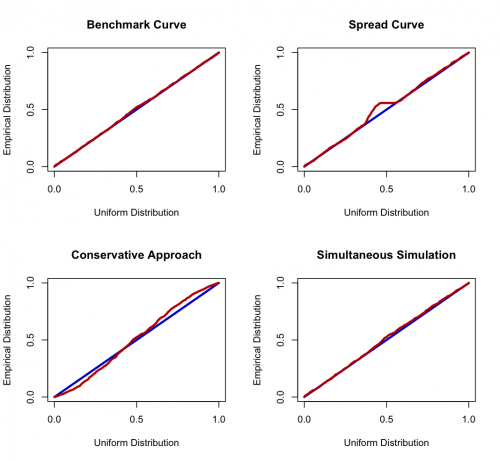

[](http://quantlet.de/index.php?p=info)

## [](http://quantlet.de/) **XFGpp** [](http://quantlet.de/d3/ia)

```yaml

Name of QuantLet : XFGpp

Published in : Applied Quantitative Finance

Description : 'Generates a P-P Plot for Backtesting of 1) basic simulation, mean adjustment,
volatility updating and volatility updating and mean adjustment simulations as well as of 2)
benchmark curve, spread curve, conservative approach and simultaneous simulation. All simulated
data follow chapter 2.4 in XFG2.'

Keywords : pp-plot, backtest, volatility, simulation, visualization

Author : Christoph Frisch, Awdesch Melzer

Submitted : Fri, June 29 2012 by Dedy Dwi Prastyo

Datafiles : 'XFGMMPL.dat, XFGMMPL2.dat, XFGMMPL3.dat, XFGMMPL4.dat, XFGMMPL5.dat, XFGMMPL6.dat,
XFGMMPL7.dat, XFGMMPL8.dat, XFGPL.dat, XFGPL2.dat, XFGPL3.dat, XFGPL4.dat, XFGPL5.dat, XFGPL6.dat,
XFGPL7.dat, XFGPL8.dat'

```






### R Code:
```r
rm(list=ls(all=TRUE))
graphics.off()

# p-p define function
XFGpp = function(MMPL,PL){
    PP    = matrix(0,ncol(PL)+1,3)
    true  = matrix(0,nrow(MMPL),ncol(PL))
    for (i in 1:nrow(MMPL)){
        k = 1
        while (k < (ncol(PL))){
            true[i,k] = c(MMPL[i,]>PL[i,k]) # true = 1 for any value of MMPL>PL
            k = k + 1
        } 
    }
    tmp = apply(1-true,1,sum) # sum up all "true"s for each row
    # tmp1 = tmp + (tmp<ncol(PL))
    # estimate pdf of each point
    j=1
    while (j < nrow(PL)) {
        PP[(ncol(PL)-tmp[j]+2),2] = PP[(ncol(PL)-tmp[j]+2),2] + 1/nrow(PL) 
        j = j + 1
    }
    PP[1:50,]
    PP[2:(ncol(PL)+1),1] = (1:ncol(PL))/ncol(PL)            # sequence
    PP[2:(ncol(PL)+1),2] = cumsum(PP[2:(ncol(PL)+1),2])     # cum sum of empirical distribution of Loss
    PP[2:(ncol(PL)+1),3] = (PP[2:(ncol(PL)+1),2]-PP[2:(ncol(PL)+1),1])^2/(ncol(PL)+1) # Mean Squared Deviation in each point
    return(PP)
}

############################
##    Basic Simulation    ##
############################

# load data
PL   = read.table("XFGPL.dat")
MMPL = read.table("XFGMMPL.dat")

# compute probability-probability plot
PP = XFGpp(MMPL,PL)
sum(PP[,3]) 	# Mean Squared Deviation

par(mfrow=c(2,2))

titl   = "Basic Simulation"

xlabel = "Uniform Distribution"
ylabel = "Empirical Distribution"

# plot
plot(PP[,1],PP[,1], type="l", col="blue3", lwd=3, ylab=ylabel, xlab=xlabel, main=titl, frame=T, axes=F)
axis(1,c(0,0.5,1))
axis(2,c(0,0.5,1))
lines(PP[,1],PP[,2],  col="red3", lwd=3)

###########################
##    Mean Adjustment    ##
###########################

# load data
PL   = read.table("XFGPL2.dat")
MMPL = read.table("XFGMMPL2.dat")

# compute probability-probability plot
PP = XFGpp(MMPL,PL)
sum(PP[,3]) 	# Mean Squared Deviation

titl   = "Mean Adjustment"

xlabel = "Uniform Distribution"
ylabel = "Empirical Distribution"

# plot
plot(PP[,1],PP[,1], type="l", col="blue3", lwd=3, ylab=ylabel, xlab=xlabel, main=titl, frame=T, axes=F)
axis(1,c(0,0.5,1))
axis(2,c(0,0.5,1))
lines(PP[,1],PP[,2],  col="red3", lwd=3)

###############################
##    Volatility Updating    ##
###############################

# load data
PL   = read.table("XFGPL3.dat")
MMPL = read.table("XFGMMPL3.dat")

# compute probability-probability plot
PP = XFGpp(MMPL,PL)
sum(PP[,3]) 	# Mean Squared Deviation

titl   = "Volatility Updating"

xlabel = "Uniform Distribution"
ylabel = "Empirical Distribution"

# plot
plot(PP[,1],PP[,1], type="l", col="blue3", lwd=3, ylab=ylabel, xlab=xlabel, main=titl, frame=T, axes=F)
axis(1,c(0,0.5,1))
axis(2,c(0,0.5,1))
lines(PP[,1],PP[,2],  col="red3", lwd=3)

#################################################
##    Volatility Updating & Mean Adjustment    ##
#################################################

# load data
PL   = read.table("XFGPL4.dat")
MMPL = read.table("XFGMMPL4.dat")

# compute probability-probability plot
PP = XFGpp(MMPL,PL)
sum(PP[,3]) 	# Mean Squared Deviation

titl   = "Volatility Updating & Mean Adjustment"

xlabel = "Uniform Distribution"
ylabel = "Empirical Distribution"

# plot
plot(PP[,1],PP[,1], type="l", col="blue3", lwd=3, ylab=ylabel, xlab=xlabel, main=titl, frame=T, axes=F)
axis(1,c(0,0.5,1))
axis(2,c(0,0.5,1))
lines(PP[,1],PP[,2],  col="red3", lwd=3)

###########################
##    Benchmark Curve    ##
###########################

# load data
PL   = read.table("XFGPL5.dat")
MMPL = read.table("XFGMMPL5.dat")

# compute probability-probability plot
PP = XFGpp(MMPL,PL)
sum(PP[,3]) 	# Mean Squared Deviation

dev.new()
par(mfrow=c(2,2))

titl   = "Benchmark Curve"

xlabel = "Uniform Distribution"
ylabel = "Empirical Distribution"

# plot
plot(PP[,1],PP[,1], type="l", col="blue3", lwd=3, ylab=ylabel, xlab=xlabel, main=titl, frame=T, axes=F)
axis(1,c(0,0.5,1))
axis(2,c(0,0.5,1))
lines(PP[,1],PP[,2],  col="red3", lwd=3)

########################
##    Spread Curve    ##
########################

# load data
PL   = read.table("XFGPL6.dat")
MMPL = read.table("XFGMMPL6.dat")

# compute probability-probability plot
PP = XFGpp(MMPL,PL)
sum(PP[,3]) 	# Mean Squared Deviation

titl   = "Spread Curve"

xlabel = "Uniform Distribution"
ylabel = "Empirical Distribution"

# plot
plot(PP[,1],PP[,1], type="l", col="blue3", lwd=3, ylab=ylabel, xlab=xlabel, main=titl, frame=T, axes=F)
axis(1,c(0,0.5,1))
axis(2,c(0,0.5,1))
lines(PP[,1],PP[,2],  col="red3", lwd=3)

#################################
##    Conservative Approach    ##
#################################

# load data
PL   = read.table("XFGPL7.dat")
MMPL = read.table("XFGMMPL7.dat")

# compute probability-probability plot
PP = XFGpp(MMPL,PL)
sum(PP[,3]) 	# Mean Squared Deviation

titl   = "Conservative Approach"

xlabel = "Uniform Distribution"
ylabel = "Empirical Distribution"

# plot
plot(PP[,1],PP[,1], type="l", col="blue3", lwd=3, ylab=ylabel, xlab=xlabel, main=titl, frame=T, axes=F)
axis(1,c(0,0.5,1))
axis(2,c(0,0.5,1))
lines(PP[,1],PP[,2],  col="red3", lwd=3)

###################################
##    Simultaneous Simulation    ##
###################################

# load data
PL   = read.table("XFGPL8.dat")
MMPL = read.table("XFGMMPL8.dat")

# compute probability-probability plot
PP = XFGpp(MMPL,PL)
sum(PP[,3]) 	# Mean Squared Deviation

titl   = "Simultaneous Simulation"

xlabel = "Uniform Distribution"
ylabel = "Empirical Distribution"

# plot
plot(PP[,1],PP[,1], type="l", col="blue3", lwd=3, ylab=ylabel, xlab=xlabel, main=titl, frame=T, axes=F)
axis(1,c(0,0.5,1))
axis(2,c(0,0.5,1))
lines(PP[,1],PP[,2],  col="red3", lwd=3)

```
