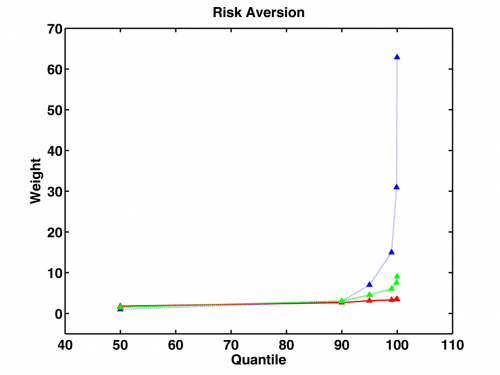

[](http://quantlet.de/index.php?p=info)

## [](http://quantlet.de/) **XFGriskaversion** [](http://quantlet.de/d3/ia)

```yaml

Name of QuantLet : XFGriskaversion

Published in : Applied Quantitative Finance

Description : 'Presents risk aversion calculated with respect to different methods. The dotted
blue, dashed-dotted green and solid red lines represent SCA-decreasing steps, SCA - equal steps and
SCA - incresing steps correspondingly.'

Keywords : asset, data visualization, graphical representation, portfolio, returns, risk aversion

See also : XFGELESC, XFGIndustryBreakdown, XFGRegionsBreakdown, XFGRsquared, XFGriskaversion2

Author : Ludger Overbeck, Maria Sokolova

Submitted : Sat, February 21 2015 by Lukas Borke

```




### MATLAB Code:
```matlab
% clear variables and close graphics
clear all
close all
clc

increasing = [50	   0.997605746
              90	   2.992817239
              95	   6.983240223
              99      14.96408619
              99.9	  30.92577813
              99.98	  62.84916201];
        
equal = [50	    1.512401694
         90	    3.024803388
         95	    4.537205082
         99	    6.049606776
         99.9   7.562008469
         99.98	9.074410163];

decreasing = [50	    1.773619625
              90	    2.660429438
              95	    3.103834344
              99	    3.325536797
              99.9	    3.436388024
              99.98  	3.491813637];
        
hold on
plot(decreasing(:,1),decreasing(:,2),'r','LineStyle','-','LineWidth',1.6)
plot(increasing(:,1),increasing(:,2),'b','LineStyle',':','LineWidth',1.6)
plot(equal(:,1),equal(:,2),'g','LineStyle','-.','LineWidth',1.6)
scatter(decreasing(:,1),decreasing(:,2),'^','r','MarkerFaceColor','r')
scatter(increasing(:,1),increasing(:,2),'^','b','MarkerFaceColor','b')
scatter(equal(:,1),equal(:,2),'^','g','MarkerFaceColor','g')
title('Risk Aversion','FontSize',16,'FontWeight','Bold')
xlabel('Quantile','FontSize',16,'FontWeight','Bold')
ylabel('Weight','FontSize',16,'FontWeight','Bold')
xlim([40 110])
ylim([-5 70])
box on
set(gca,'LineWidth',1.6,'FontSize',16,'FontWeight','Bold')
hold off

% to save plot please uncomment following lines 
% print -painters -dpng -r600 XFGriskaversion.png
% print -painters -dpdf -r600 XFGriskaversion.pdf

```
