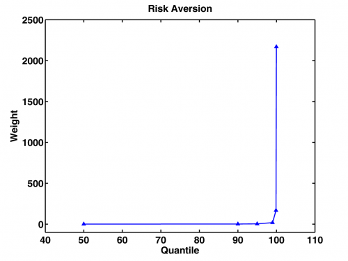

[](http://quantlet.de/index.php?p=info)

## [](http://quantlet.de/) **XFGriskaversion2** [](http://quantlet.de/d3/ia)

```yaml

Name of QuantLet : XFGriskaversion2

Published in : Applied Quantitative Finance

Description : 'Presents the risk aversion when the weights are directly set to 0.1 at the 50%, 90%,
95%-quantiles, 0.15 at the 99% and 99.9%- quantiles and 0.4 at the 99.98%-quantile.'

Keywords : asset, data visualization, graphical representation, portfolio, returns, risk aversion

See also : XFGELESC, XFGIndustryBreakdown, XFGRegionsBreakdown, XFGRsquared, XFGriskaversion

Author : Ludger Overbeck, Maria Sokolova

Submitted : Sun, March 01 2015 by Lukas Borke

```




### MATLAB Code:
```matlab
% clear variables and close graphics
clear all
close all
clc

aversion=[50	0.2
          90	1.2
          95	3.2
          99	18.2
          99.9	168.2
          99.98	2168.2];
        
hold on
plot(aversion(:,1),aversion(:,2),'b','LineWidth',1.6)
scatter(aversion(:,1),aversion(:,2),'^','b','MarkerFaceColor','b')

title('Risk Aversion','FontSize',16,'FontWeight','Bold')
xlabel('Quantile','FontSize',16,'FontWeight','Bold')
ylabel('Weight','FontSize',16,'FontWeight','Bold')
xlim([40 110])
ylim([-100 2500])
box on
set(gca,'LineWidth',1.6,'FontSize',16,'FontWeight','Bold')
hold off

% to save plot please uncomment following lines 
% print -painters -dpng -r600 XFGriskaversion2.png
% print -painters -dpdf -r600 XFGriskaversion2.pdf

```
