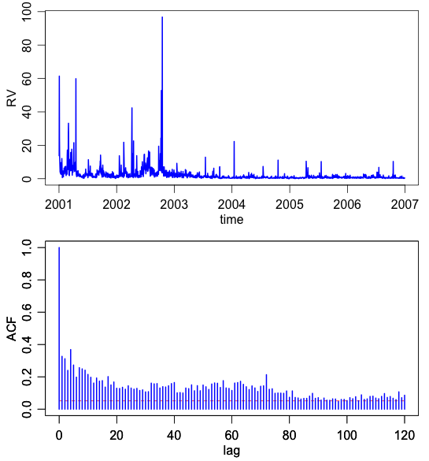

##  **XFGrvtsacf**


```yaml
Name of QuantLet : XFGrvtsacf

Published in : XFG_3rd Edition

Description : 'Plots time evolvement and sample autocorrelation 
function of the realized volatility for IBM. The upper panel shows 
the evolvement of daily realized volatility over the analyzed sample 
period 2001-2006. The lower panel presents the implied sample 
autocorrelation functions (ACFs).'

Keywords : 'acf, plot, graphical representation, frequency, 
time-series, autocorrelation'

See also : 

Author : Nicolas Hautsch, Uta Pigorsch

Submitted :

Datafile : ibm.dat

Example :
- 'Time evolvement and sample autocorrelation function of the realized 
volatility for IBM.'


```



```R
# clear history
rm(list = ls(all = TRUE))
graphics.off()

# load data
ibm = read.table("ibm.dat", header = F, col.names = c("date", "rv", "returns"))

# if save output as pdf
# pdf(file='rv_ts_acf.pdf',paper='special',width=6,height=6)
op        = par(no.readonly = TRUE)
par(mgp   = c(1.75, 0.75, 0))
par(mar   = c(3, 3, 0.7, 0.7))
par(mfrow = c(2, 1))
plot(as.Date(as.character(ibm$date), "%Y%m%d"), ibm$rv, type = "l", xlab = "time", 
     ylab = "RV", lwd = 2, col = "blue")

# plots the lower panel
acfData   = acf(ibm$rv, lag.max = 120, type = "correlation", plot = FALSE)
conf      = 2/sqrt(length(ibm$rv))
plot(acfData$lag, array(data = conf, dim = length(acfData$lag)), type = "l", xlab = "lag", 
     ylab = "ACF", lwd = 1, col = "red", lty = 2, ylim = c(0, 1))
par(new   = T)
plot(acfData$lag, acfData$acf, type = "h", xlab = "lag", ylab = "ACF", lwd = 2, col = "blue", 
    ylim = c(0, 1)) 


```
