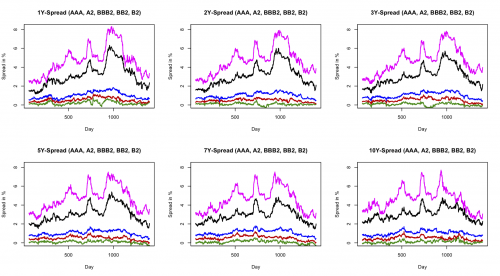

[](http://quantlet.de/index.php?p=info)

## [](http://quantlet.de/) **XFGseries** [](http://quantlet.de/d3/ia)

```yaml

Name of QuantLet : XFGseries

Published in : Applied Quantitative Finance

Description : 'Displays spread curves for the time period: 1 January 1999 to 19 May 2004. Note: The
time period differs from XFG book.'

Keywords : plot, time-series, financial, data visualization, graphical representation

Author : Awdesch Melzer, Germar Knoechlein

Submitted : Tue, July 10 2012 by Dedy Dwi Prastyo

Datafiles : INA2.txt, INAAA.txt, INB2.txt, INBB2.txt, INBBB2.txt, USTF.txt

```




### R Code:
```r
# clear variables and close windows
rm(list=ls(all=TRUE))
graphics.off()

# load data
USTF   = read.table("USTF.txt")
INAAA  = read.table("INAAA.txt")
INA2   = read.table("INA2.txt")
INBBB2 = read.table("INBBB2.txt")
INBB2  = read.table("INBB2.txt")
INB2   = read.table("INB2.txt")

# compute spreads: yield - benchmark (USTF)
SINAAA  = INAAA-USTF 
SINA2   = INA2 - USTF
SINBBB2 = INBBB2 - USTF
SINBB2  = INBB2 - USTF
SINB2   = INB2 - USTF
    
xmin    = 60             # first observation
xmax    = nrow(SINAAA)   # last observation
x       = (xmin:xmax)    # dummy variable
  
# Plot
par(mfrow=c(2,3)) 

z1 = plot(x,SINAAA[xmin:xmax,3], type="l", col="green4", lwd=1.7, ylab="Spread in %", xlab="Day", main="1Y-Spread (AAA, A2, BBB2, BB2, B2)", ylim=c(0,8.2), frame=T,axes=F)
lines(x, SINA2[xmin:xmax,3],col="red3", lwd=1.7)
lines(x, SINBBB2[xmin:xmax,3],col="blue", lwd=1.7)
lines(x, SINBB2[xmin:xmax,3],col="black", lwd=1.7)  
lines(x, SINB2[xmin:xmax,3],col="magenta", lwd=1.7)
axis(side=1, at=seq(0,2000,500),labels=seq(0,2000,500))
axis(side=2, at=seq(0,10,2),labels=seq(0,10,2)) 
  
z1 = plot(x,SINAAA[xmin:xmax,4],  type="l", col="green4", lwd=1.7, ylab="Spread in %", xlab="Day", main="2Y-Spread (AAA, A2, BBB2, BB2, B2)", ylim=c(0,8.2), frame=T,axes=F)
lines(x, SINA2[xmin:xmax,4],col="red3", lwd=1.7)
lines(x, SINBBB2[xmin:xmax,4],col="blue", lwd=1.7)
lines(x, SINBB2[xmin:xmax,4],col="black", lwd=1.7)  
lines(x, SINB2[xmin:xmax,4],col="magenta", lwd=1.7)  
axis(side=1, at=seq(0,2000,500),labels=seq(0,2000,500))
axis(side=2, at=seq(0,10,2),labels=seq(0,10,2))  
  
z1 = plot(x,SINAAA[xmin:xmax,5],  type="l", col="green4", lwd=1.7, ylab="Spread in %", xlab="Day", main="3Y-Spread (AAA, A2, BBB2, BB2, B2)", ylim=c(0,8.2), frame=T,axes=F)
lines(x, SINA2[xmin:xmax,5],col="red3", lwd=1.7)
lines(x, SINBBB2[xmin:xmax,5],col="blue", lwd=1.7)
lines(x, SINBB2[xmin:xmax,5],col="black", lwd=1.7)  
lines(x, SINB2[xmin:xmax,5],col="magenta", lwd=1.7)  
axis(side=1, at=seq(0,2000,500),labels=seq(0,2000,500))
axis(side=2, at=seq(0,10,2),labels=seq(0,10,2))      
  
z1 = plot(x,SINAAA[xmin:xmax,7], type="l", col="green4", lwd=1.7, ylab="Spread in %", xlab="Day", main="5Y-Spread (AAA, A2, BBB2, BB2, B2)", ylim=c(0,8.2), frame=T,axes=F)
lines(x, SINA2[xmin:xmax,7],col="red3", lwd=1.7)
lines(x, SINBBB2[xmin:xmax,7],col="blue", lwd=1.7)
lines(x, SINBB2[xmin:xmax,7],col="black", lwd=1.7)  
lines(x, SINB2[xmin:xmax,7],col="magenta", lwd=1.7)  
axis(side=1, at=seq(0,2000,500),labels=seq(0,2000,500))
axis(side=2, at=seq(0,10,2),labels=seq(0,10,2))      

z1 = plot(x,SINAAA[xmin:xmax,8], type="l", col="green4", lwd=1.7, ylab="Spread in %", xlab="Day", main="7Y-Spread (AAA, A2, BBB2, BB2, B2)", ylim=c(0,8.2), frame=T,axes=F)
lines(x, SINA2[xmin:xmax,8],col="red3", lwd=1.7)
lines(x, SINBBB2[xmin:xmax,8],col="blue", lwd=1.7)
lines(x, SINBB2[xmin:xmax,8],col="black", lwd=1.7)  
lines(x, SINB2[xmin:xmax,8],col="magenta", lwd=1.7)  
axis(side=1, at=seq(0,2000,500),labels=seq(0,2000,500))
axis(side=2, at=seq(0,10,2),labels=seq(0,10,2))
  
z1 = plot(x,SINAAA[xmin:xmax,9], type="l", col="green4", lwd=1.7, ylab="Spread in %", xlab="Day", main="10Y-Spread (AAA, A2, BBB2, BB2, B2)", ylim=c(0,8.2), frame=T,axes=F)
lines(x, SINA2[xmin:xmax,9],col="red3", lwd=1.7)
lines(x, SINBBB2[xmin:xmax,9],col="blue", lwd=1.7)
lines(x, SINBB2[xmin:xmax,9],col="black", lwd=1.7)  
lines(x, SINB2[xmin:xmax,9],col="magenta", lwd=1.7)  
axis(side=1, at=seq(0,2000,500),labels=seq(0,2000,500))
axis(side=2, at=seq(0,10,2),labels=seq(0,10,2))
```
