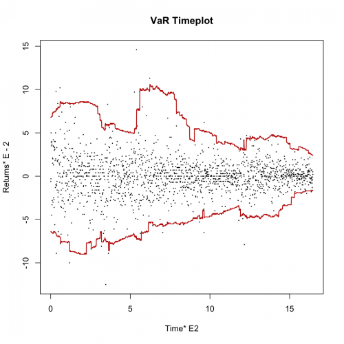
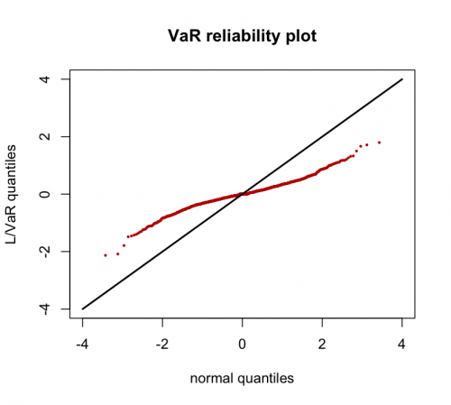

[](http://quantlet.de/index.php?p=info)

## [](http://quantlet.de/) **XFGtimeseries** [](http://quantlet.de/d3/ia)

```yaml

Name of QuantLet : XFGtimeseries

Published in : Applied Quantitative Finance

Description : 'Plots and computes 99% Value-at-Risk for a given time series. Graphical
representation of reliability of VaR calculation.'

Keywords : VaR, time-series, plot, graphical representation, risk, tail, financial

Author : Germar Knoechlein, Awdesch Melzer

Submitted : Fri, June 29 2012 by Dedy Dwi Prastyo

Datafiles : XFGMMPL.dat, XFGPL.dat

```






### R Code:
```r
# ---------------------------------------------------------------------- Book XFG
# ---------------------------------------------------------------------- See_also -
# ---------------------------------------------------------------------- Macro XFGtimeseries
# ---------------------------------------------------------------------- Description Displays VaR time series
# ---------------------------------------------------------------------- Usage -
# ---------------------------------------------------------------------- Author Xplore: Germar Knoechlein, 20010106 R:
# Awdesch Melzer 20120614 ----------------------------------------------------------------------

# clear variables and close windows
rm(list = ls(all = TRUE))
graphics.off()

# open library
install.packages("fExtremes")
library(fExtremes)

# load data
PL = read.table("XFGPL.dat")
MMPL = read.table("XFGMMPL.dat")

# compute VaR for upper tail of the empirical distribution function with alpha = 0.01.
n = nrow(PL)
j = 1
VaRSu = NULL
while (j <= n) {
    Vinput = t(PL[j, ])
    temp = VaR(Vinput, alpha = 0.01, type = "sample", tail = c("upper"))
    VaRSu[j] = temp
    j = j + 1
}

# compute VaR for lower tail of the empirical distribution function with alpha = 0.01.
j = 1
VaRSl = NULL
while (j <= n) {
    Vinput = t(PL[j, ])
    temp = VaR(Vinput, alpha = 0.01, type = "sample", tail = c("lower"))
    VaRSl[j] = temp
    j = j + 1
}

# dummy for time variable
x = 1:nrow(MMPL)

# plot of the time series and its VaR estimates (red lines)
plot(x, t(MMPL), type = "p", pch = 19, cex = 0.15, ylab = paste("Returns*", expression(E - 2)), xlab = paste("Time*", expression(E2)), 
    main = "VaR Timeplot", axes = F, frame = T)
axis(side = 1, at = seq(0, 1500, 500), labels = seq(0, 15, 5))
axis(side = 2, at = seq(-0.015, 0.015, 0.005), labels = seq(-15, 15, 5))
lines(VaRSl, col = "red3", lwd = 1.5)
lines(VaRSu, col = "red3", lwd = 1.5)

# QQ-Plot for lower tail
VaRqqplot = function(y, VaR0) {
    y = as.vector(MMPL)
    bad = (nrow(y) > 2)
    if (bad == FALSE) {
        paste("y must be vector or matrix")
    }
    
    n = nrow(y)
    d = ncol(y)
    
    h = 0
    w = matrix(1, 1, d)
    p = apply(y * w, 1, sum)  # portfolio
    
    p = p[(h + 1):n]
    qn = qnorm(((1:(n - h)) - 0.5)/(n - h), 0, 1)  # compute quantiles of a standard normal
    tmp = p/c(VaR0)
    line = c(min(-4, min(qn), min(tmp)), max(4, max(qn), max(tmp)))
    VaRqq = cbind(sort(qn), sort(tmp))
    
    dev.new()
    qqplot(VaRqq[, 1], VaRqq[, 2], ylim = c(-4, 4), xlim = c(-4, 4), pch = 19, cex = 0.3, col = "red3", main = "VaR reliability plot", 
        ylab = "L/VaR quantiles", xlab = "normal quantiles")
    lines(line, line, lwd = 2)
}

VaRqqplot(MMPL, VaRSl) 

```
