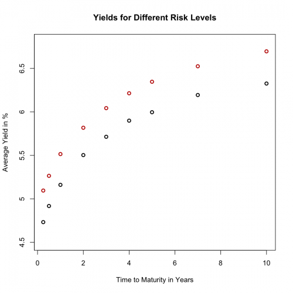

[](http://quantlet.de/index.php?p=info)

## [](http://quantlet.de/) **XFGyields** [](http://quantlet.de/d3/ia)

```yaml

Name of QuantLet : XFGyields

Published in : Applied Quantitative Finance

Description : Displays averaged yields for different times to maturities and different risk levels.

Keywords : VaR, delta-gamma, monte-carlo, simulation, sampling

See also : VaRestMC

Author : Germar Knöchlein, Awdesch Melzer

Submitted : Sat, June 16 2012 by Dedy Dwi Prastyo

Datafile : XFGINAAA.dat, XFGUSTF.dat

```




### R Code:
```r
# clear variables and close windows
rm(list = ls(all = TRUE))
graphics.off()

# load data
USTF = read.table("XFGUSTF.dat")
INAAA = read.table("XFGINAAA.dat")

# first observation point
xmin = 1

# last observation point
xmax = nrow(USTF)

# time to maturity
x = c(0.25, 0.5, 1, 2, 3, 4, 5, 7, 10)

# average USTF
y = apply(USTF[xmin:xmax, 4:12], 2, mean)

# average INAAA
y = cbind(y, apply(INAAA[xmin:xmax, 4:12], 2, mean))

# plot averaged government and industry yields
z1 = plot(x, y[, 1], col = "black", pch = 1, lwd = 2, ylab = "Average Yield in %", xlab = "Time to Maturity in Years", ylim = c(4.5, 
    6.8), frame = TRUE, axes = FALSE, main = "Yields for Different Risk Levels")  # government USTF
axis(side = 1, at = seq(0, 10, 2), labels = seq(0, 10, 2))
axis(side = 2, at = seq(0, 10, 0.5), labels = seq(0, 10, 0.5))
z2 = points(x, y[, 2], col = "red3", lwd = 2)  # industry INAAA 

```
